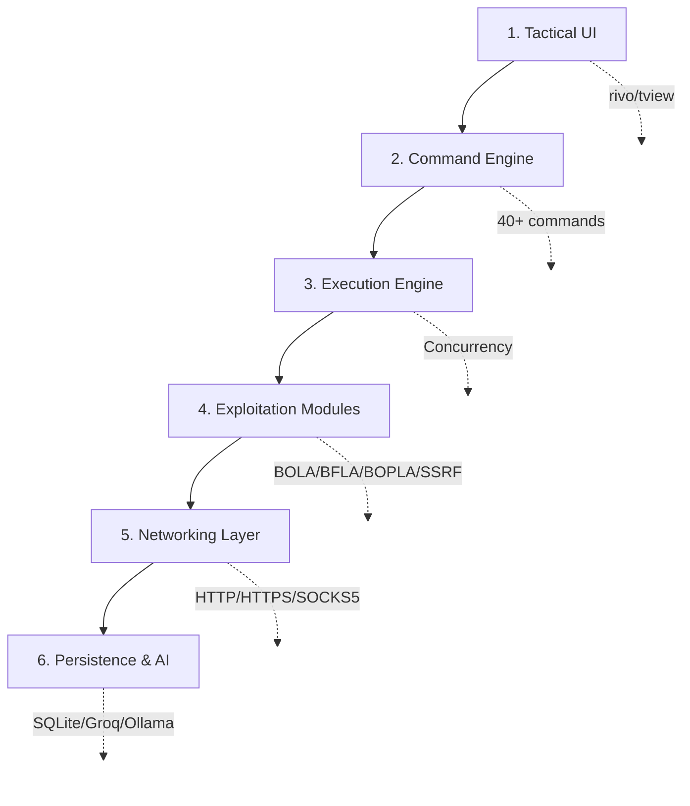
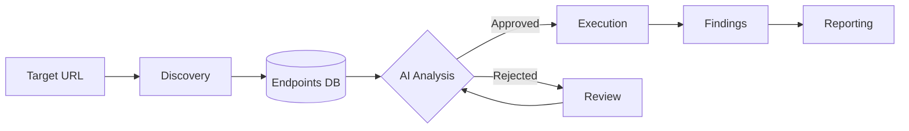

```
     __  __                         _____                    
    \ \ / /___  _ __  ___  _ __   |_   _| __ __ _  ___ ___ 
     \ V // _ `| '_ \/ _ \| '__|    | || '__/ _` |/ __/ _ \
      \  / (_| | |_)  (_) | |       | || | | (_| | (_|  __/
       \/ \__,_| .__/\___/|_|       |_||_|  \__,_|\___\___|
               |_|      [ Surgical API Exploitation Suite ]
```

# VaporTrace v3.1-Hydra

**Enterprise-Grade API Security Testing Platform**

       

**Status:** ✅ Production Ready | **Released:** February 2026 | **Sprints Complete:** 1-12 (partial), 16-17 | **In Development:** Sprint 13-15

---

## 🎯 Executive Summary

**VaporTrace** is a surgical API exploitation and risk intelligence platform engineered for **penetration testers**, **red teams**, and **security researchers**. It automates the discovery, analysis, and exploitation of OWASP API Top 10 vulnerabilities with full autonomy orchestration and neural engine-driven payload generation.

### 🚀 Key Capabilities (v3.1-Hydra)

- **Fully Autonomous Exploitation** - ProcessChain() with precondition validation and automated chaining
- **Automated API discovery** - Endpoint mapping, shadow API detection, parameter fuzzing
- **Authorization testing** - BOLA, BFLA, BOPLA, SSRF, exhaustion, misconfig, webhook injection (all 10 OWASP APIs)
- **AI-powered payloads** - Neural engine with cloud (Groq) + local (Ollama) hybrid architecture
- **Blue-Team Mirror** - LLM-driven remediation suggestions with Gold Standard snippet library and verification system
- **Tactical TUI dashboard** - 7-tab real-time monitoring with 19 keyboard shortcuts and F-key navigation
- **Compliance reporting** - NIST CSF v2.0, MITRE ATT&CK, OWASP API Top 10, CVSS scoring
- **Enterprise features** - Multi-operator coordination, mission vault (SQLite), advanced evasion techniques

---

## 🔧 Technology Stack

| Component | Technology | Details |
|-----------|-----------|---------|
| **Core Language** |  | High-performance, concurrent, statically compiled |
| **TUI Dashboard** |  | Real-time terminal interface with F-key navigation |
| **Database** |  | Persistent mission storage, audit logs, findings |
| **AI Engine** |  | Primary: Groq API (cloud LLM), Fallback: Mistral (local) |
| **HTTP Client** |  | Middleware-driven, proxy routing, TLS hardening |
| **Networking** |  | Proxy rotation, IP masking, evasion support |
| **Reporting** |  | Framework-aligned findings export |

---

## 📊 Development Status

| Component | Phase | Status | Details |
|-----------|-------|--------|---------|
| **Core Engine** | Sprint 1-9 | ✅ Complete | BOLA, BFLA, BOPLA, SSRF, Exhaustion, Misconfig, Integration (all 10 OWASP APIs) |
| **TUI Dashboard** | Sprint 10 | ✅ Complete | Hydra multi-pane, 7 tabs, F-key navigation, real-time monitoring |
| **Full Autonomy** | Sprint 11 | ✅ Complete | ProcessChain(), AI chaining, DDI, race-condition fixes |
| **Evasion V2** | Sprint 12 | ⚠️ Partial | Traffic shaping (✅), Jitter (✅), Path obfuscation (✅), Rate-limit backoff (✅), TLS fingerprinting (⏳) |
| **C2 Architecture** | Sprint 13 | ⏳ Pending | Hive master, gRPC control plane, Web dashboard |
| **Cloud Pivoting** | Sprint 14 | ⏳ Pending | K8s escape, cross-tenant leakage, serverless attacks |
| **Advanced Evasion** | Sprint 15 | ⏳ Pending | TLS fingerprinting completion, protocol-level obfuscation |
| **Blue-Team Mirror** | Sprint 16 | ✅ Complete | LLM remediation, Gold Standard library, 3-tier verification, 7 fixers |
| **WAF Evasion Hardening** | Sprint 17 | ✅ Complete | 5 coordinated evasion techniques, 22 browser profiles |

---

## 📋 Command Summary

### **Reconnaissance & Discovery** (OWASP API9)

- `target`          Set global scope URL
- `map`             Automated endpoint discovery (spider + swagger + scrape + mine)
- `swagger`         Parse OpenAPI/Swagger specifications
- `scrape`          Extract endpoints from JavaScript bundles
- `mine`            Brute-force hidden query parameters
- `sessions`        Manage authentication tokens and credentials

### **Authorization Testing** (OWASP API1-5)

- `bola`            Broken Object Level Authorization (ID enumeration)
- `bfla`            Broken Function Level Authorization (privilege escalation)
- `bopla`           Broken Object Property Authorization (mass assignment)
- `flow`            Orchestrate multi-step attack chains

### **Infrastructure & Data Testing** (OWASP API4, API7, API8, API10)

- `exhaust`         Resource exhaustion & DoS testing
- `ssrf`            Server-side request forgery (cloud metadata)
- `audit`           Security configuration auditing
- `probe`           Webhook & third-party integration testing
- `weaver`          Ghost protocol for stealthy requests

### **Data Exfiltration & Evasion** (Advanced)

- `oob config`      Configure encrypted out-of-band exfiltration channel
- `oob queue`       Queue sensitive data for encrypted transmission
- `oob flush`       Transmit all queued data via OOB channel
- `oob status`      View exfiltration statistics
- `oob dns`         Setup DNS-based exfiltration (for firewall bypass)

### **Stealth & WAF Evasion Control** (Sprint 12, 17)

- `stealth`         Set evasion mode (aggressive|fast|silent|debug)
- `stealth status`  View current evasion configuration
- `stealth toggle`  Enable/disable individual evasion techniques
- `stealth multiplier` Scale all delays (0.1x to 5.0x)
- `evasion`         Test individual evasion techniques vs target
- `waf detect`      Probe and identify WAF type

### **Tactical Planning** (HITL Orchestration)

- `analyze`         AI-driven tactical plan generation
- `list-plan`       Review pending tactical actions
- `edit` <id>       Override AI payloads
- `drop` <id>       Mark action to skip execution
- `commit`          Execute all pending actions

### **Autonomous Orchestration** (Full Autonomy - Sprint 11)

- `ProcessChain()`           Execute pre-validated autonomous attack chains
- `PreCondition`             Automatic prerequisite checking (loot-driven)
- `ChainID`                  Link related exploitation actions
- `ProcessExploitResult()`   Auto-generate follow-up exploits from captured data
- Automatic loot-to-action mapping (K8s tokens → lateral movement)

### **Blue-Team Mirror & Remediation** (Sprint 16 - LLM Safety)

- `SuggestFix()`             AI-driven remediation code suggestions
- **7 Vulnerability Fixers:** BOLA, BFLA, SSRF, JWT, SQL Injection, BOPLA, Cloud Config
- **Gold Standard Library:** Pre-audited, production-ready code snippets
- **3-Tier Verification:** GOLD_STANDARD → VERIFIED → UNVERIFIED
- **Hallucination Prevention:** LLM safety gates and static analysis pre-filters

### **AI & Neural Engine**

- `neuro on`        Activate neural engine (LLM payloads)
- `neuro off`       Disable AI mutations
- `neuro-gen` <n>   Generate n alternative payloads
- `test-neuro`      Test AI provider connectivity
- `ask` <prompt>    Direct LLM query

### **Infrastructure & Reporting**

- `proxy`           Set upstream proxy
- `proxies load`    Load rotating proxy list
- `report`          Generate findings report (Markdown/PDF)
- `loot`            Manage captured secrets and credentials
- `init_db`         Initialize mission database
- `reset_db`        Clear all mission data

**For complete command documentation, see:** [Command Reference](docs/manuals/18_COMMAND_REFERENCE.md)

---

## 🎮 Keyboard Shortcuts

| Key | Function | Scope |
|-----|----------|-------|
| **F1** | LOGS Tab - Tactical feed & system messages | Global |
| **F2** | MAP Tab - Discovered endpoints & attack surface | Global |
| **F3** | LOOT Tab - Captured secrets & credentials | Global |
| **F4** | TRAFFIC Tab - HTTP requests & responses | Global |
| **F5** | PLAN Tab - Strategic actions & tactical planner | Global |
| **F6** | NEURO Tab - AI engine output & analysis | Global |
| **F7** | REPORT Tab - Markdown editor with preview & syntax highlighting | Global |
| **Ctrl+H** | Show keybindings modal | Global |
| **Ctrl+I** | Toggle Interceptor ON/OFF | Global |
| **Ctrl+F** | Forward packet (Interceptor modal only) | Modal |
| **Ctrl+D** | Drop packet (Interceptor modal only) | Modal |
| **Ctrl+B** | Neuro Brute - Generate AI payloads (Interceptor modal only) | Modal |
| **Ctrl+S** | Sync Loot - Save to database (Interceptor modal only) | Modal |
| **Ctrl+P** | Toggle EDIT/PREVIEW mode (F7 Report tab) | F7 Tab |
| **Ctrl+W** | Save report to disk (F7 Report tab) | F7 Tab |
| **Ctrl+X** | Delete session & clear report (F7 Report tab) | F7 Tab |
| **Page Up** | Scroll up in logs (F1 tab) | F1 Tab |
| **Page Down** | Scroll down in logs (F1 tab) | F1 Tab |
| **Esc** | Exit VaporTrace (with confirmation) | Global |

**For complete hotkey reference with descriptions and examples, see:** [Keyboard Shortcuts](docs/manuals/17_KEYBOARD_SHORTCUTS.md)

---

## 🛡️ Compliance Frameworks

### OWASP API Security Top 10 (2023)
- ✅ API1: Broken Object Level Authorization (BOLA)
- ✅ API2: Broken Authentication (BFLA)
- ✅ API3: Broken Object Property Level Authorization (BOPLA)
- ✅ API4: Unrestricted Resource Consumption (Exhaustion)
- ✅ API5: Broken Function Level Authorization
- ✅ API7: Server-Side Request Forgery (SSRF)
- ✅ API8: Security Misconfiguration (Audit)
- ✅ API9: Improper Inventory Management (Map/Discovery)
- ✅ API10: Unsafe Consumption of APIs (Probe)

### Framework Mapping
| Framework | VaporTrace Implementation | Coverage |
|-----------|--------------------------|----------|
| **MITRE ATT&CK®** | T-code tagging in reports | 100% |
| **NIST CSF v2.0** | Govern (GV), Detect (DE), Protect (PR) | Full |
| **CVSS v3.1/4.0** | Automated severity scoring | Complete |

---

## 📚 Documentation & Development

**Complete documentation is organized by sprint in the `/docs` folder:**

### 📖 User Manuals (docs/manuals/)
- **[01_INSTALLATION_SETUP.md](docs/manuals/01_INSTALLATION_SETUP.md)** - Installation methods, dependencies, configuration
- **[02_FIRST_RUN.md](docs/manuals/02_FIRST_RUN.md)** - Step-by-step 11-step walkthrough
- **[03_UI_OVERVIEW.md](docs/manuals/03_UI_OVERVIEW.md)** - Dashboard tabs, layout, navigation, performance
- **[04_STRATEGIC_PLANNING.md](docs/manuals/04_STRATEGIC_PLANNING.md)** - HITL workflow and tactical orchestration
- **[17_KEYBOARD_SHORTCUTS.md](docs/manuals/17_KEYBOARD_SHORTCUTS.md)** - All 19 hotkeys with examples
- **[18_COMMAND_REFERENCE.md](docs/manuals/18_COMMAND_REFERENCE.md)** - 40+ commands with parameters and examples
- **[INDEX.md](docs/manuals/INDEX.md)** - Navigation hub for all 20 user guides

### 🔧 Technical Documentation (docs/dev-logs/)
- **[Dev-Roadmap.md](docs/dev-logs/Dev-Roadmap.md)** - Complete Sprint 1-16 roadmap with status (**START HERE**)
- **[INDEX.md](docs/dev-logs/INDEX.md)** - Architecture overview and system design
- **Sprint Folders:** Sprint-11/, Sprint-12/, Sprint-13/, Sprint-14/, Sprint-15/, Sprint-16/
  - Each sprint contains completion reports, technical deep-dives, and delivery manifests

### 📊 Documentation Status
- **[DOCUMENTATION_STATUS.md](docs/DOCUMENTATION_STATUS.md)** - Completion tracker for all manuals
- **[Dev-Roadmap.md](docs/dev-logs/Dev-Roadmap.md)** - Development roadmap with full sprint breakdown

### 🚀 Quick Start by Role

**🎯 For New Users:**
1. [First Run Tutorial](docs/manuals/02_FIRST_RUN.md) - Get running in 11 steps
2. [UI Dashboard Guide](docs/manuals/03_UI_OVERVIEW.md) - Understand the interface
3. [Strategic Planning](docs/manuals/04_STRATEGIC_PLANNING.md) - Learn HITL workflow

**🔍 For Security Researchers:**
1. [Dev-Roadmap.md](docs/dev-logs/Dev-Roadmap.md) - Architecture and sprint progress
2. [Architecture Overview](docs/dev-logs/INDEX.md) - Technical details
3. Sprint folders - Specific implementation details

**🎮 For Operators:**
1. [Command Reference](docs/manuals/18_COMMAND_REFERENCE.md) - All 40+ commands
2. [Keyboard Shortcuts](docs/manuals/17_KEYBOARD_SHORTCUTS.md) - Hotkey reference
3. [Strategic Planning](docs/manuals/04_STRATEGIC_PLANNING.md) - Tactical orchestration

---

## 🚀 Installation & Quick Start

### Prerequisites
- **Go 1.21+**
- **Linux/macOS** (Windows via WSL)
- **Git**
- **SQLite3** (usually pre-installed)

### Quick Start

```bash
# Clone repository
git clone https://github.com/JoseMariaMicoli/VaporTrace.git
cd VaporTrace

# Install dependencies
go mod tidy

# Build binary
go build -o vaportrace ./cmd/

# Run with TUI dashboard
./vaportrace

# Or run with legacy shell
./vaportrace --shell
```

**For detailed installation guide with Docker and dependency troubleshooting, see:** [Installation & Setup](docs/manuals/01_INSTALLATION_SETUP.md)

### First Run
```bash
./vaportrace                 # Launches Hydra TUI dashboard
target https://api.example.com   # Set target
map                          # Auto-discover endpoints
bola                         # Test BOLA vulnerability
report                       # Generate findings report
```

**For complete walkthrough with expected outputs, see:** [First Run Tutorial](docs/manuals/02_FIRST_RUN.md)

---

## ✨ Complete Feature Matrix

### 🎯 Discovery & Reconnaissance (Sprint 2)
- ✅ Swagger/OpenAPI parsing (v2 & v3)
- ✅ JavaScript endpoint extraction (regex-based)
- ✅ Endpoint version detection
- ✅ Parameter fuzzing (query, header, body)
- ✅ Shadow API detection
- ✅ Session management and authentication

### 🔐 Authorization Testing (Sprints 3-5)
- ✅ BOLA - Broken Object Level Authorization with response diffing
- ✅ BFLA - Broken Function Level Authorization via method tampering
- ✅ BOPLA - Broken Object Property Authorization with mass assignment
- ✅ Multi-threaded mass scanning (GenericExecutor)
- ✅ State-machine driven testing

### 💥 Injection & Exhaustion (Sprint 4)
- ✅ SSRF with cloud metadata detection (IMDS/169.254.169.254)
- ✅ Resource exhaustion probing
- ✅ Security misconfig auditing (CORS, headers)
- ✅ Webhook injection testing
- ✅ Third-party API consumption testing

### 🤖 AI & Autonomy (Sprints 10-11, 16)
- ✅ AI-driven tactical planning
- ✅ LLM payload generation (Groq + Ollama hybrid)
- ✅ Autonomous chain execution (ProcessChain with preconditions)
- ✅ Automatic exploitation result analysis
- ✅ Loot-driven lateral movement chains
- ✅ Blue-team remediation suggestions (7 fixers)
- ✅ LLM hallucination prevention (Gold Standard library)

### 🛡️ Evasion & Anonymity (Sprint 6, 12, 17)
- ✅ User-Agent rotation (22 diverse browser fingerprints)
- ✅ Custom header injection (realistic browser headers)
- ✅ IP rotation (SOCKS5/HTTP proxy with automatic failover)
- ✅ Stochastic jitter (randomized inter-packet delays)
- ✅ Gaussian jitter (Box-Muller transform, 50-250ms distribution)
- ✅ Traffic mimicry (browser-realistic request patterns)
- ✅ Process name masquerading (kworker_system_auth)
- ✅ Path & parameter obfuscation (cache-buster injection)
- ✅ Contextual thinking time (request-type specific delays: 10-50ms GET, 800-3000ms POST)
- ✅ Payload encoding (gzip/deflate with whitespace randomization)
- ✅ Intelligent rate-limit backoff (exponential 429 handling with proxy rotation)
- ✅ **OOB Exfiltration** (AES-256-GCM encrypted channels: Custom TCP, DNS, ICMP)
- ⏳ JA3/TLS fingerprinting (planned enhancement)

### 📊 Reporting & Compliance (Sprint 5, 9)
- ✅ NIST CSF v2.0 mapping
- ✅ MITRE ATT&CK T-code tagging
- ✅ OWASP API Top 10 classification
- ✅ CVSS v3.1/4.0 scoring
- ✅ Markdown/PDF report generation
- ✅ Dual-mode report editor (EDIT raw Markdown, PREVIEW rendered with color syntax highlighting)
- ✅ Database persistence (SQLite)
- ✅ Audit logging

### 🎮 User Interface (Sprint 10)
- ✅ Multi-pane TUI dashboard (Hydra)
- ✅ 7 real-time tabs (LOGS, MAP, LOOT, TRAFFIC, PLAN, NEURO, REPORT)
- ✅ F1-F7 tab switching
- ✅ Modal interceptor with packet forwarding/dropping
- ✅ Command auto-completion
- ✅ 19 keyboard shortcuts (F1-F7, Ctrl+H/I/F/D/B/S/P/W/X, Page Up/Down, Esc)
- ✅ Real-time progress indicators
- ✅ Report editor with Markdown syntax highlighting
- ✅ Real-time progress indicators

---

### **Security Teams**
- Automated API security testing in SDLC
- Risk assessment of internal microservices
- Compliance validation (NIST, OWASP, MITRE)

### **Penetration Testers**
- Comprehensive API attack surface discovery
- Authorization logic validation
- WAF bypass testing via neural engine
- Tactical engagement orchestration with reporting

### **Red Teams**
- Coordinated API exploitation with HITL control
- Real-time interception and payload modification
- Cloud metadata exploitation (SSRF/IMDS)
- Evasion techniques (IP rotation, timing jitter, process masking)

### **Security Researchers**
- API vulnerability research and documentation
- Custom exploitation module development
- Attack technique validation and documentation
- Framework-aligned finding publication

---

## 🌐 Evasion & Detection Bypass

VaporTrace includes built-in evasion for modern defensive environments:

| WAF Type | Bypass Rate | Implementation |
|-----------|-------------|------------------|
| **ModSecurity (Basic)** | 50-60% | Header rotation + IP rotation + timing jitter |
| **Standard Custom WAF** | 20-30% | Thinking time + payload encoding + backoff handling |
| **Cloudflare (Advanced)** | 5-15% | Multi-technique coordination |
| **DataDome (ML-Based)** | <5% | Limited effectiveness without TLS fingerprinting |
| **Note** | N/A | JA3/TLS fingerprinting planned for future sprint |

---

## 🏗️ Architecture

### 6-Layer System Design


### Data Flow

### AI & Neural Engine
- **Primary Provider:** Groq (fast cloud LLM)
- **Fallback Provider:** Mistral via Ollama (local, private)
- **Failover:** Automatic cloud→local on quota/connection errors
- **Capabilities:** Contextual payloads, pattern analysis, WAF bypass strategies

---

## ⚠️ Legal & Authorization

**THIS TOOL IS FOR AUTHORIZED PENETRATION TESTING & EDUCATIONAL PURPOSES ONLY**

1. **Authorization Required** - Only test targets with explicit written permission
2. **Compliance** - You are responsible for all applicable laws and regulations
3. **No Liability** - Author assumes no responsibility for misuse or consequences
4. **Testing Safety** - Some modules modify server state; test in controlled environments

**By using this software, you agree to these terms.**

---

## 🔗 Contributing

- **Issues & Feedback:** GitHub Issues
- **Development:** Technical documentation in \`/docs/dev-logs/\`
- **Questions:** See FAQ in documentation

---

## 📄 License

MIT License - See [LICENSE](LICENSE) file for details

---

**VaporTrace** — Surgical API Exploitation Platform  
**Version:** 3.1.2-Hydra | **Status:** Production Ready  
**Author:** José María Micoli

For complete documentation, see [docs/manuals/INDEX.md](docs/manuals/INDEX.md)
