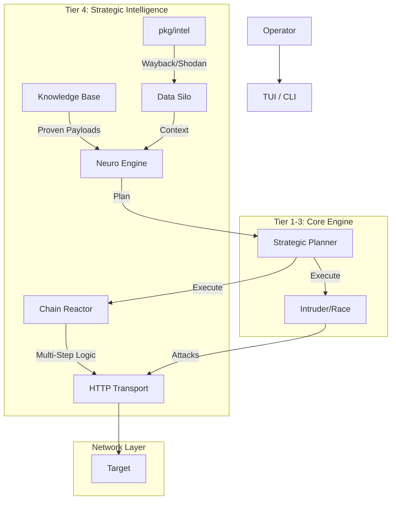

# Tier 4: Strategic Intelligence & Enterprise Capabilities
**Action Plan, Architecture, and OffSec Engineering Guide**

**Status:** 🟢 READY FOR PLANNING  
**Prerequisites:** Tier 1, 2, and 3 completed.

---

## 1. Executive Summary: What is Tier 4?

While Tier 1-3 focused on the *direct interaction* with the target (sending packets, analyzing responses), **Tier 4** focuses on **Context and Workflow**.

It transforms VaporTrace from a "Tool" into a "Platform" by adding:
1.  **External Intelligence (OSINT):** What does the internet know about this target? (Shodan, Wayback Machine).
2.  **Attack Chaining (The "Chain Reactor"):** Automating multi-step dependencies (e.g., *Login -> Extract Token -> Use Token in BOLA attack*).
3.  **Institutional Memory:** Storing successful attack patterns to train the local AI model.

---

## 2. Action Plan (3-Day Implementation Cycle)

### Day 1: The OSINT Modules (External Eyes)
**Objective:** Integrate passive reconnaissance to find forgotten endpoints and exposed infrastructure without touching the target.

*   **Task 1.1:** Create `pkg/intel/shodan.go`.
    *   Implement API client for Shodan (Port scanning, CVE lookup).
    *   Command: `intel shodan <domain>`
*   **Task 1.2:** Create `pkg/intel/wayback.go`.
    *   Implement client for Wayback Machine CDX API.
    *   Logic: Fetch historical URLs, filter out images/css, feed results into `GlobalDiscovery` (F2 Map).
    *   Command: `intel history <domain>`
*   **Task 1.3:** Integration.
    *   Update `DataSilo` to accept OSINT data.
    *   Update `analyze` to consider open ports and old endpoints when generating the Strategic Plan.

### Day 2: The Chain Reactor (Automated Workflows)
**Objective:** Move beyond single-request attacks to stateful, multi-step exploitation chains.

*   **Task 2.1:** Enhance `pkg/logic/flow.go`.
    *   Implement variable extraction logic (Regex/JSONPath) that persists across steps.
    *   Create `ChainDefinition` struct (List of steps + failure conditions).
*   **Task 2.2:** Chain Builder CLI.
    *   Command: `chain create <name>` -> Interactive mode to record steps from F4 history.
    *   Command: `chain run <name>` -> Execute sequence.
*   **Task 2.3:** AI Chain Generation.
    *   Update `NeuroEngine` prompts to recognize login patterns and suggest chains automatically (e.g., "I see a login and a user profile. Create a chain?").

### Day 3: The Knowledge Base (Institutional Memory)
**Objective:** Save "Wins" to make the tool smarter over time.

*   **Task 3.1:** Create `pkg/kb/manager.go`.
    *   Schema: `attack_patterns` table in SQLite.
    *   Function: When a user marks an action as "EXPLOITED", save the payload and context.
*   **Task 3.2:** AI Retraining (Lightweight).
    *   Feed successful payloads from the KB back into the `PayloadGenPrompt` context for future scans.
*   **Task 3.3:** Final Reporting Polish.
    *   Include OSINT data and Chain results in the F7 Report.

---

## 3. Logical & Architectural Explanation

### The Architecture Diagram (Post-Tier 4)



### Key Architectural Shifts

1.  **The OSINT Ingestion Pipeline:**
    *   *Logic:* Previously, endpoints only came from `map` (Active) or `swagger` (Passive Doc).
    *   *Tier 4:* We introduce `pkg/intel`. This package queries 3rd party APIs. The results are normalized and injected into `GlobalDiscovery`. This means the **Fuzzer (Tier 2)** and **Intruder (Tier 3)** can now attack endpoints that *no longer exist in the current HTML* but exist in history (Ghost Endpoints).

2.  **State Management (The Chain Reactor):**
    *   *Logic:* HTTP is stateless. Hacks are stateful.
    *   *Architecture:* We introduce a `SessionContext` map.
        *   Step 1 (Login): Response Body -> Extract `access_token`.
        *   Variable Storage: `SessionContext["token"] = "eyJ..."`.
        *   Step 2 (Attack): Request Header -> `Authorization: Bearer {{token}}`.
    *   This allows VaporTrace to fuzz deep inside an application, past the login screen.

3.  **Feedback Loop (Knowledge Base):**
    *   *Logic:* Current AI generates payloads based on generic training.
    *   *Architecture:* Successful exploits are saved to `vaportrace.db`. Next time the Neuro Engine runs, it queries: `SELECT payload FROM successful_hacks WHERE type='SQLi'`. It injects these "proven winners" into the prompt context, making the AI smarter specific to *your* targets.

---

## 4. OffSec Engineering Guide (Red Team Perspective)

This section explains *why* we build these features from a hacker's mindset.

### A. The Power of "Ghost Endpoints" (Wayback Machine)
**Engineering Logic:** Developers often delete links to old API versions (e.g., `/api/v1/user`) but forget to disable the code in the backend.
**OffSec Value:** These "Ghost Endpoints" often lack the WAF rules or AuthZ checks applied to the new `/api/v2/user`.
**Implementation Strategy:**
1.  Query `http://web.archive.org/cdx/search/cdx?url=*.target.com/*&output=json&fl=original&collapse=urlkey`.
2.  Filter for `.json`, `.php`, `.aspx` or paths containing `/api/`.
3.  Feed these directly into the **Intruder** to check for `200 OK` (Zombie APIs).

### B. Shodan & The "Bypass" (Origin IP Detection)
**Engineering Logic:** APIs are often protected by Cloudflare/AWS WAF. However, the origin server (the actual EC2 IP) might be exposed on Shodan.
**OffSec Value:** If we find the Origin IP via Shodan (matching SSL certs), we can point VaporTrace to the IP address (Host Header Spoofing). This bypasses the WAF entirely.
**Implementation Strategy:**
1.  `intel shodan <domain>` -> Get IP list.
2.  Auto-schedule a **Race Condition** or **Intruder** attack against the IP, forcing the `Host: <domain>` header.

### C. Attack Chaining: The "Golden Path"
**Engineering Logic:** Vulnerabilities rarely live in isolation. A BOLA (IDOR) often requires a valid low-privilege session.
**OffSec Value:** Automated scanners fail because they just fuzz `/user/123` and get `401 Unauthorized`. They assume it's secure.
**Implementation Strategy:**
1.  **Define the Chain:**
    *   *Req 1:* POST /login (Creds) -> Extract `token`.
    *   *Req 2:* POST /profile/update (Headers: `Auth: {{token}}`) -> Change email.
2.  **Fuzz the Chain:**
    *   Run the **Intruder** on *Req 2*, but for every payload, the engine ensures *Req 1* is valid or cached.

### D. Institutional Memory: Building the Playbook
**Engineering Logic:** If a specific obscure WAF bypass (`%2527 OR 1=1`) worked on Client A, it will likely work on Client A's other apps because they share the same infrastructure.
**Implementation Strategy:**
1.  When a user marks a finding as `CONFIRMED` in F5.
2.  Store payload in `Local_KB`.
3.  On startup, load `Local_KB` into the `NeuroEngine` context as "High Priority Payloads".

---

## 5. Next Steps for You

To begin **Tier 4**, you do not need to write all code at once. Start with **Day 1 (OSINT)**.

**Recommended First Command to Implement:**
```bash
# Get historical API endpoints
intel history https://target.com
```

This creates immediate value by feeding the Tier 3 Intruder with targets that no other scanner is finding.