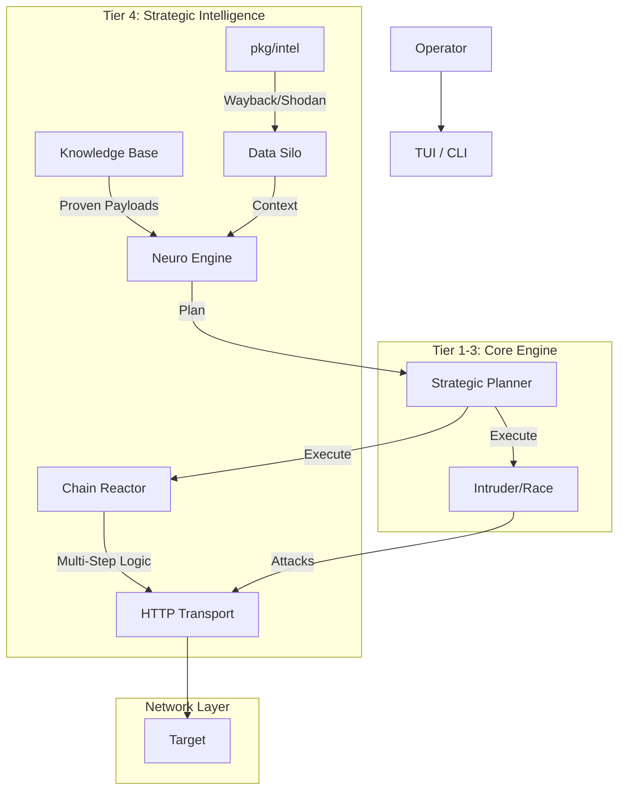

/*
Copyright (c) 2026 José María Micoli
Licensed under the Business Source License 1.1
Change Date: 2033-02-17
Change License: Apache-2.0

You may:
✔ Study
✔ Modify
✔ Use for internal security testing

You may NOT:
✘ Offer as a commercial service
✘ Sell derived competing products
*/

# Tier 4: Strategic Intelligence & Enterprise Capabilities
**Action Plan, Architecture, and OffSec Engineering Guide**

**Status:** 🟢 READY FOR PLANNING  
**Prerequisites:** Tier 1, 2, and 3 completed.

---

## 1. Executive Summary: What is Tier 4?

While Tier 1-3 focused on the *direct interaction* with the target (sending packets, analyzing responses), **Tier 4** focuses on **Context and Workflow**.

It transforms VaporTrace from a "Tool" into a "Platform" by adding:
1.  **External Intelligence (OSINT):** What does the internet know about this target? (Shodan, Wayback Machine).
2.  **Attack Chaining (The "Chain Reactor"):** Automating multi-step dependencies (e.g., *Login -> Extract Token -> Use Token in BOLA attack*).
3.  **Institutional Memory:** Storing successful attack patterns to train the local AI model.

---

## 2. Action Plan (3-Day Implementation Cycle)

### Day 1: The OSINT Modules (External Eyes)
**Objective:** Integrate passive reconnaissance to find forgotten endpoints and exposed infrastructure without touching the target.

*   **Task 1.1:** Create `pkg/intel/shodan.go`.
    *   Implement API client for Shodan (Port scanning, CVE lookup).
    *   Command: `intel shodan <domain>`
*   **Task 1.2:** Create `pkg/intel/wayback.go`.
    *   Implement client for Wayback Machine CDX API.
    *   Logic: Fetch historical URLs, filter out images/css, feed results into `GlobalDiscovery` (F2 Map).
    *   Command: `intel history <domain>`
*   **Task 1.3:** Integration.
    *   Update `DataSilo` to accept OSINT data.
    *   Update `analyze` to consider open ports and old endpoints when generating the Strategic Plan.

### Day 2: The Chain Reactor (Automated Workflows)
**Objective:** Move beyond single-request attacks to stateful, multi-step exploitation chains.

*   **Task 2.1:** Enhance `pkg/logic/flow.go`.
    *   Implement variable extraction logic (Regex/JSONPath) that persists across steps.
    *   Create `ChainDefinition` struct (List of steps + failure conditions).
*   **Task 2.2:** Chain Builder CLI.
    *   Command: `chain create <name>` -> Interactive mode to record steps from F4 history.
    *   Command: `chain run <name>` -> Execute sequence.
*   **Task 2.3:** AI Chain Generation.
    *   Update `NeuroEngine` prompts to recognize login patterns and suggest chains automatically (e.g., "I see a login and a user profile. Create a chain?").

### Day 3: The Knowledge Base (Institutional Memory)
**Objective:** Save "Wins" to make the tool smarter over time.

*   **Task 3.1:** Create `pkg/kb/manager.go`.
    *   Schema: `attack_patterns` table in SQLite.
    *   Function: When a user marks an action as "EXPLOITED", save the payload and context.
*   **Task 3.2:** AI Retraining (Lightweight).
    *   Feed successful payloads from the KB back into the `PayloadGenPrompt` context for future scans.
*   **Task 3.3:** Final Reporting Polish.
    *   Include OSINT data and Chain results in the F7 Report.

---

## 3. Logical & Architectural Explanation

### The Architecture Diagram (Post-Tier 4)



### Key Architectural Shifts

1.  **The OSINT Ingestion Pipeline:**
    *   *Logic:* Previously, endpoints only came from `map` (Active) or `swagger` (Passive Doc).
    *   *Tier 4:* We introduce `pkg/intel`. This package queries 3rd party APIs. The results are normalized and injected into `GlobalDiscovery`. This means the **Fuzzer (Tier 2)** and **Intruder (Tier 3)** can now attack endpoints that *no longer exist in the current HTML* but exist in history (Ghost Endpoints).

2.  **State Management (The Chain Reactor):**
    *   *Logic:* HTTP is stateless. Hacks are stateful.
    *   *Architecture:* We introduce a `SessionContext` map.
        *   Step 1 (Login): Response Body -> Extract `access_token`.
        *   Variable Storage: `SessionContext["token"] = "eyJ..."`.
        *   Step 2 (Attack): Request Header -> `Authorization: Bearer {{token}}`.
    *   This allows VaporTrace to fuzz deep inside an application, past the login screen.

3.  **Feedback Loop (Knowledge Base):**
    *   *Logic:* Current AI generates payloads based on generic training.
    *   *Architecture:* Successful exploits are saved to `vaportrace.db`. Next time the Neuro Engine runs, it queries: `SELECT payload FROM successful_hacks WHERE type='SQLi'`. It injects these "proven winners" into the prompt context, making the AI smarter specific to *your* targets.

---

## 4. OffSec Engineering Guide (Red Team Perspective)

This section explains *why* we build these features from a hacker's mindset.

### A. The Power of "Ghost Endpoints" (Wayback Machine)
**Engineering Logic:** Developers often delete links to old API versions (e.g., `/api/v1/user`) but forget to disable the code in the backend.
**OffSec Value:** These "Ghost Endpoints" often lack the WAF rules or AuthZ checks applied to the new `/api/v2/user`.
**Implementation Strategy:**
1.  Query `http://web.archive.org/cdx/search/cdx?url=*.target.com/*&output=json&fl=original&collapse=urlkey`.
2.  Filter for `.json`, `.php`, `.aspx` or paths containing `/api/`.
3.  Feed these directly into the **Intruder** to check for `200 OK` (Zombie APIs).

### B. Shodan & The "Bypass" (Origin IP Detection)
**Engineering Logic:** APIs are often protected by Cloudflare/AWS WAF. However, the origin server (the actual EC2 IP) might be exposed on Shodan.
**OffSec Value:** If we find the Origin IP via Shodan (matching SSL certs), we can point VaporTrace to the IP address (Host Header Spoofing). This bypasses the WAF entirely.
**Implementation Strategy:**
1.  `intel shodan <domain>` -> Get IP list.
2.  Auto-schedule a **Race Condition** or **Intruder** attack against the IP, forcing the `Host: <domain>` header.

### C. Attack Chaining: The "Golden Path"
**Engineering Logic:** Vulnerabilities rarely live in isolation. A BOLA (IDOR) often requires a valid low-privilege session.
**OffSec Value:** Automated scanners fail because they just fuzz `/user/123` and get `401 Unauthorized`. They assume it's secure.
**Implementation Strategy:**
1.  **Define the Chain:**
    *   *Req 1:* POST /login (Creds) -> Extract `token`.
    *   *Req 2:* POST /profile/update (Headers: `Auth: {{token}}`) -> Change email.
2.  **Fuzz the Chain:**
    *   Run the **Intruder** on *Req 2*, but for every payload, the engine ensures *Req 1* is valid or cached.

### D. Institutional Memory: Building the Playbook
**Engineering Logic:** If a specific obscure WAF bypass (`%2527 OR 1=1`) worked on Client A, it will likely work on Client A's other apps because they share the same infrastructure.
**Implementation Strategy:**
1.  When a user marks a finding as `CONFIRMED` in F5.
2.  Store payload in `Local_KB`.
3.  On startup, load `Local_KB` into the `NeuroEngine` context as "High Priority Payloads".

---

## 5. Next Steps for You

To begin **Tier 4**, you do not need to write all code at once. Start with **Day 1 (OSINT)**.

**Recommended First Command to Implement:**
```bash
# Get historical API endpoints
intel history https://target.com
```

This creates immediate value by feeding the Tier 3 Intruder with targets that no other scanner is finding.

This implementation creates the Intelligence Layer. It allows VaporTrace to query external data sources (Wayback Machine and Shodan) to populate your attack surface map without sending a single packet to the target (Passive Recon), finding "Ghost Endpoints" that standard crawling misses.

📚 Tier 4 - Day 1 Documentation
1. TIER_4_DAY_1_SUMMARY.md
code Markdown

# Tier 4 Day 1: Strategic Intelligence (OSINT)

**Status:** ✅ COMPLETE
**Focus:** Passive Reconnaissance & Infrastructure Analysis

## 🧠 The "Platform" Shift
Tier 4 moves VaporTrace from "scanning what we see" to "finding what was hidden". 
By integrating external intelligence sources, we can identify targets that aren't linked in the current application HTML but technically still exist (and are often vulnerable).

## 📦 What Was Built

### 1. Wayback Machine Integration (`pkg/intel/wayback.go`)
- **Capability:** Queries the Internet Archive's CDX API.
- **Filtering:** Automatically removes static assets (images, CSS) to focus on API endpoints.
- **Integration:** Results are fed directly into the **F2 Map** and **Database**.
- **Value:** Finds "Ghost Endpoints" (e.g., old `/v1/` APIs) that developers forgot to disable.

### 2. Shodan Integration (`pkg/intel/shodan.go`)
- **Capability:** Resolves domain to IP and queries Shodan.io for open ports.
- **Output:** Lists ports, services, and banners directly in the VaporTrace logs.
- **Value:** Identifies potential origin servers or exposed administrative panels on non-standard ports.

### 3. Intel Command (`pkg/engine/core.go`)
- New command structure:
  - `intel wayback <domain>`
  - `intel shodan <ip/domain>`
  - `intel config shodan <key>`

## 🧪 How to Test It

1. **Rebuild:** `go build`
2. **Run:** `./VaporTrace`
3. **Ghost Hunting (No API Key needed):**
   ```bash
   intel wayback tesla.com

Watch F1 Logs and F2 Map populate with thousands of historical endpoints.

    Infrastructure Scan (API Key needed):
    code Bash

    intel config shodan YOUR_API_KEY
    intel shodan 8.8.8.8

🚀 Impact on Workflow

    Run intel wayback.

    Wait for F2 Map to populate with historical endpoints.

    Run analyze (Tier 1).

    Run commit (Tier 3) to fuzzy these "forgotten" endpoints.

code Code

### 2. YOUR_ACTION_ITEMS.md (Updated)

```markdown
# Tier 4 Status Report

## ✅ Completed (Day 1)
- [x] **Package Structure:** Created `pkg/intel`.
- [x] **Wayback Module:** Implemented CDX API client + logic filtering.
- [x] **Shodan Module:** Implemented Host API client.
- [x] **Integration:** Wired into `core.go` and `GlobalDiscovery`.

## 🟡 Remaining (Day 2 & 3)
- [ ] **The Chain Reactor:** Build the stateful multi-request engine (`chain` command).
- [ ] **Knowledge Base:** Implement the "Institutional Memory" system.

## 🚀 Recommendation
Proceed to **Tier 4 - Day 2: The Chain Reactor**. This is the most complex logic piece of the entire suite, enabling multi-step flows like "Login -> Get Token -> Attack Profile".

Implementation Handover

You now have the code for Tier 4 - Day 1.

    Create pkg/intel/ directory.

    Add config.go, wayback.go, shodan.go.

    Update pkg/engine/core.go.

## day 2

    This is the most sophisticated logic component of VaporTrace. It enables Stateful Exploitation. Instead of firing single, isolated requests, the Chain Reactor executes a sequence of dependent steps (e.g., Login -> Extract Token -> Inject Token into Header -> Fuzz Protected Endpoint).

    📚 Tier 4 - Day 2 Documentation
1. TIER_4_DAY_2_SUMMARY.md
code Markdown

# Tier 4 Day 2: The Chain Reactor

**Status:** ✅ COMPLETE
**Focus:** Stateful, Multi-Step Exploitation

## 🔗 The Problem
Standard tools (Intruder, Fuzzers) are **stateless**. They send one packet and forget it.
Modern apps require state:
1. You must login to get a Token.
2. You must attach that Token to the header.
3. You must request a `CSRF-Token` before posting data.

## 📦 What Was Built
We implemented the **Chain Reactor Engine** (`pkg/logic/chain_reactor.go`), a programmable workflow engine inside VaporTrace.

### Capabilities
1.  **Variable Extraction:** Can parse JSON (`json:auth.token`) or Regex from response bodies.
2.  **Context Persistency:** Extracted variables (`{{token}}`) are stored in memory and injected into subsequent steps.
3.  **Dynamic Headers:** Steps can use variables in Headers (e.g., `Authorization: Bearer {{token}}`).
4.  **CLI Builder:** You can build complex chains entirely from the VaporTrace console.

## 🧪 Usage Example: Login & Attack

**Scenario:** We need to authenticate against `api.target.com` before fuzzing the `/profile` endpoint.

### 1. Create the Chain
```bash
chain create login_flow

2. Step 1: Login
code Bash

chain add login_flow POST https://api.target.com/login '{"user":"admin","pass":"1234"}'

3. Define Extraction

We want to grab the access_token from the JSON response.
code Bash

# Syntax: chain extract <chain> <step> <var_name> <type> <selector>
chain extract login_flow 1 token json access_token

4. Step 2: Use the Token

Now we access the protected endpoint using {{token}}.
code Bash

chain add login_flow GET https://api.target.com/profile ""
chain header login_flow 2 Authorization "Bearer {{token}}"

5. Execute
code Bash

chain run login_flow

Result in Logs:

    Step 1: POST /login -> 200 OK

    [green]CAPTURED: {{token}} = eyJhbGci...

    Step 2: GET /profile -> 200 OK (Authenticated!)

🚀 Impact

This allows the Intruder (Tier 3) to be wrapped inside a chain in future updates, enabling "Authenticated Fuzzing" without manually copying tokens.
code Code

### 2. YOUR_ACTION_ITEMS.md (Updated)

```markdown
# Tier 4 Status Report

## ✅ Completed
- [x] **Day 1: Intel Layer** (Wayback/Shodan).
- [x] **Day 2: Chain Reactor** (Stateful Engine).
  - [x] Implemented `pkg/logic/extractors.go`.
  - [x] Implemented `pkg/logic/chain_reactor.go`.
  - [x] Implemented `chain` CLI command.

## 🟡 Remaining (Day 3)
- [ ] **Knowledge Base:** Build the "Institutional Memory" to save successful chains/payloads.
- [ ] **Final Integration:** Ensure Chains feed into the Reporting module.

## 🚀 Recommendation
Proceed to **Tier 4 - Day 3: Knowledge Base & Final Polish**. This wraps up the project by ensuring your successful hacks are saved and reusable.

Implementation Handover

You now have the code for Tier 4 - Day 2.

    Create pkg/logic/extractors.go.

    Create pkg/logic/chain_reactor.go.

    Update pkg/engine/core.go (Add chain command).