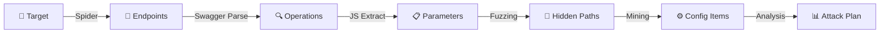
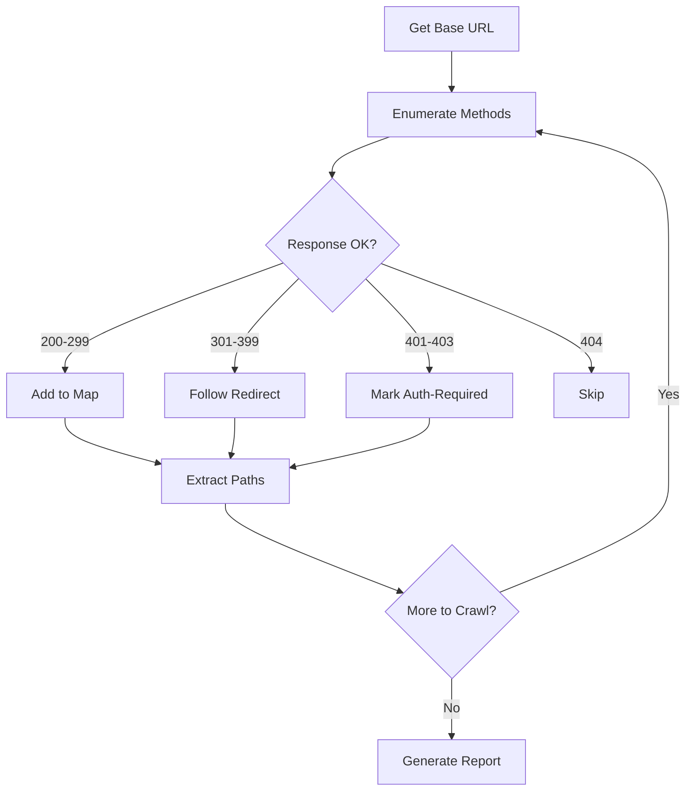
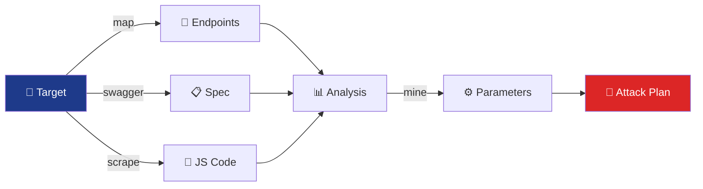

/*
Copyright (c) 2026 José María Micoli
Licensed under the Business Source License 1.1
Change Date: 2033-02-17
Change License: Apache-2.0

You may:
✔ Study
✔ Modify
✔ Use for internal security testing

You may NOT:
✘ Offer as a commercial service
✘ Sell derived competing products
*/

# 05 - Advanced Reconnaissance & Discovery

> **For:** Security assessors and penetration testers  
> **Read Time:** 25-30 minutes  
> **Difficulty:** ⭐⭐⭐ Intermediate  
> **Last Updated:** February 8, 2026

---

## 📑 Table of Contents

1. [Overview](#overview)
2. [Discovery Workflow](#discovery-workflow)
3. [Target Management](#target-management)
4. [API Discovery Modules](#api-discovery-modules)
5. [Advanced Techniques](#advanced-techniques)
6. [Practical Examples](#practical-examples)
7. [Troubleshooting](#troubleshooting)
8. [Best Practices](#best-practices)

---

## Overview

> <span style="background-color: #1e3a8a; color: white; padding: 2px 6px; border-radius: 3px;">**PHASE 1**</span> The **reconnaissance phase** is where you discover and map all API endpoints, parameters, and authentication mechanisms. VaporTrace automates this process with intelligent discovery modules that identify hidden endpoints, enumerate parameters, and extract behavioral patterns.

### Discovery Pipeline



### Key Objectives

| Objective | Module | Output | Time |
|-----------|--------|--------|------|
| Discover API structure | `map` | Endpoint tree | 2-5 min |
| Parse specifications | `swagger` | Operations list | 1-2 min |
| Extract JS endpoints | `scrape` | Dynamic routes | 3-10 min |
| Find hidden paths | `mine` | Fuzzy matches | 5-15 min |
| Capture sessions | `sessions` | Auth tokens | 1-3 min |

---

## Discovery Workflow

### Step 1: Target Setup

#### Command: `target`

```bash
> target https://api.vulnerable.com
[green]✓ TARGET:[-] Set to https://api.vulnerable.com
[cyan]DISCOVERY:[-] Initializing target analysis...
```

**Options Available:**

```go
target <url>                 // Set target
target <url> --proxy <ip:port>  // With proxy
target <url> --cert /path/cert  // Custom cert
target <url> --insecure     // Skip SSL verification
```

**Best Practices:**
- ✅ Start with base API URL (e.g., `/api/v1`)
- ✅ Use `--insecure` for self-signed certs in labs
- ✅ Configure proxy if behind corporate firewall
- ✅ Verify target is accessible before discovery

---

### Step 2: Spider & Mapping

#### Command: `map`

Maps all accessible endpoints through HTTP method enumeration and response analysis.

```bash
> map
[cyan]DISCOVERY:[-] Spidering endpoints...
[blue]SPIDER:[-] GET /api/v1 (200 OK)
[blue]SPIDER:[-] GET /api/v1/users (200 OK)
[blue]SPIDER:[-] POST /api/v1/users (401 Unauthorized)
[blue]SPIDER:[-] GET /api/v1/users/{id} (200 OK)
[green]✓ MAP:[-] Discovered 23 endpoints in 2.3 seconds
```

**What It Does:**
1. Enumerates HTTP methods (GET, POST, PUT, DELETE, PATCH, HEAD, OPTIONS)
2. Follows redirects and checks for 200/401/403 responses
3. Extracts path parameters (e.g., `{id}`, `{userId}`)
4. Identifies endpoint patterns
5. Flags authentication-required endpoints

**Configuration Options:**

```
map --depth 3               // Crawl depth (default: 2)
map --timeout 30s           // Request timeout
map --method GET,POST       // Specific methods only
map --filter /internal      // Skip paths matching
map --workers 10            // Parallel threads
```

**Output Structure:**

```
API Map: https://api.vulnerable.com
├── /api/v1
│   ├── GET /users (200, public)
│   ├── POST /users (401, auth-required)
│   ├── GET /users/{id} (200, public)
│   ├── PUT /users/{id} (403, permission-denied)
│   └── GET /admin (401, restricted)
└── /api/v2
    ├── GET /products (200, public)
    └── POST /products (201, creates-resource)
```

---

### Step 3: Swagger/OpenAPI Parsing

#### Command: `swagger`

Automatically discovers and parses OpenAPI/Swagger specifications.

```bash
> swagger
[cyan]DISCOVERY:[-] Searching for Swagger/OpenAPI endpoints...
[green]✓ SWAGGER:[-] Found: https://api.vulnerable.com/swagger.json
[blue]PARSE:[-] Parsing operations...
[cyan]OPERATIONS:[-] GET /v1/users (description: "Retrieve users")
[cyan]OPERATIONS:[-] POST /v1/users (requestBody: User object)
[cyan]OPERATIONS:[-] PUT /v1/users/{id} (parameters: [id, name, email])
[cyan]OPERATIONS:[-] DELETE /v1/users/{id}
[green]✓ SWAGGER:[-] Extracted 34 operations in 1.2s
```

**Detection Paths Checked:**

```
/swagger.json
/swagger.yaml
/openapi.json
/api-docs
/api/docs
/api/v1/docs
/docs/openapi.yaml
/.well-known/swagger.json
/v1/swagger.json
/specification/openapi.json
```

**Extracted Information:**

```yaml
Operation: GET /users/{id}
  Description: Retrieve user by ID
  Parameters:
    - id (path, required, integer)
    - include_profile (query, optional, boolean)
  Response:
    200:
      schema: User object
    401: Unauthorized
    404: Not Found
  Authentication: Bearer Token
  Rate-Limit: 100 req/min
```

---

### Step 4: JavaScript Endpoint Extraction

#### Command: `scrape`

Extracts endpoints from frontend JavaScript bundles (React, Vue, Angular).

```bash
> scrape
[cyan]DISCOVERY:[-] Downloading JS bundles...
[blue]JAVASCRIPT:[-] Found 12 bundle files
[cyan]SCRAPE:[-] Analyzing bundle.js (2.3 MB)
[cyan]SCRAPE:[-] Found API calls: 
  → axios.get('/api/users')
  → fetch('/api/products', {method: 'POST'})
  → api.delete('/api/admin/settings')
[cyan]SCRAPE:[-] Analyzing vendor~app.js (1.8 MB)
[cyan]SCRAPE:[-] Found 18 unique endpoints
[green]✓ SCRAPE:[-] Extracted 34 dynamic endpoints in 4.2s
```

**Detected Patterns:**

```javascript
// Patterns automatically extracted:
fetch('https://api.example.com/v1/users')
axios.post('/api/data')
$.ajax({url: '/api/config'})
XMLHttpRequest.open('GET', '/api/status')
WebSocket('wss://api.example.com/ws')
```

**Common Issues & Solutions:**

| Issue | Cause | Solution |
|-------|-------|----------|
| No JS found | Static API or CDN | Use `mine` for fuzzing |
| Endpoints obfuscated | Webpack minification | Use `--deobfuscate` flag |
| CORS blocks analysis | Browser security | Results include CORS pre-flight |
| Large bundles | Too much JavaScript | Use `--max-size 5MB` |

---

### Step 5: Parameter Mining & Fuzzing

#### Command: `mine`

Discovers hidden parameters using fuzzing against known parameter dictionaries.

```bash
> mine
[cyan]DISCOVERY:[-] Fuzzing parameters...
[blue]FUZZ:[-] Testing GET /api/users with 2,000 common params
[yellow]FOUND:[-] admin=true (changes behavior)
[yellow]FOUND:[-] include_deleted=1 (returns archived users)
[yellow]FOUND:[-] sort_by=email (changes ordering)
[green]✓ MINE:[-] Discovered 12 new parameters in 8.3s
```

**Built-in Parameter Dictionaries:**

```
- Common parameters (100+): page, limit, offset, sort, filter, search, id, etc.
- Debug parameters: debug, verbose, trace, logs, timing, etc.
- Admin parameters: admin, superadmin, internal, system, etc.
- Filter parameters: where, query, filter, and/or operators
- Output parameters: format, output, type, response, pretty, etc.
```

**Fuzzing Strategies:**

```
mine --dict common              // Use common parameter list
mine --dict admin               // Test admin/privilege params
mine --dict debug               // Test debug/timing params
mine --dict all                 // Use all dictionaries (slower)
mine --wordlist /path/custom    // Custom parameter list
mine --method POST              // Test POST parameters
mine --timeout 120              // Longer timeout for large APIs
```

**Example Output:**

```
Parameter: admin
  Type: Boolean
  Affected Endpoints:
    GET /api/users → Returns all users (normally limited)
    GET /api/reports → Returns internal reports
  Risk Level: 🔴 CRITICAL (BFLA vulnerability)
  
Parameter: include_deleted
  Type: Boolean
  Affected Endpoints:
    GET /api/users → Returns 500 archived users
    GET /api/data → Shows deleted records
  Risk Level: 🟡 HIGH (Information Disclosure)
```

---

### Step 6: Session & Authentication Capture

#### Command: `sessions`

Captures and analyzes authentication mechanisms and session tokens.

```bash
> sessions
[cyan]DISCOVERY:[-] Capturing authentication patterns...
[blue]AUTH:[-] Detected authentication methods:
  ✓ Bearer Token (JWT format)
  ✓ API Key (x-api-key header)
  ✓ Basic Auth (base64 encoded)
[cyan]SESSIONS:[-] Token format analysis:
  JWT Claims: {"sub": user_id, "roles": [...], "exp": timestamp}
  Token Lifetime: 3600 seconds (1 hour)
  Refresh URL: POST /auth/refresh
[green]✓ SESSIONS:[-] Captured 3 authentication methods
```

**Authentication Types Detected:**

| Type | Detection | Usage |
|------|-----------|-------|
| JWT | `Authorization: Bearer eyJ...` | Token-based, stateless |
| API Key | `X-API-Key: abc123...` | Simple, key-based |
| OAuth2 | `/oauth2/authorize` endpoints | 3-leg token exchange |
| SAML | `<saml:Response>` XML | Enterprise SSO |
| Basic | `Authorization: Basic ...` | Username:password |

---

## API Discovery Modules

### Module: Spider

**Purpose:** Discovers all accessible endpoints

```
COMMAND: map
STATUS: Core discovery
TIME: 2-5 minutes
ACCURACY: High (actual HTTP enumeration)
```

**Algorithm:**



---

### Module: Swagger Parser

**Purpose:** Parses API specifications

```
COMMAND: swagger
STATUS: Supplementary
TIME: 1-2 minutes
ACCURACY: Very High (from specification)
```

**Detection Methods:**

```bash
1. Common paths check
   /swagger.json, /swagger.yaml, /openapi.json

2. Response header analysis
   x-api-version, x-api-docs-url

3. HTML meta tags
   <meta name="api-docs" content="/api-docs">

4. Well-known endpoints
   /.well-known/openapi.json
```

---

### Module: JavaScript Scraper

**Purpose:** Extracts endpoints from frontend code

```
COMMAND: scrape
STATUS: Supplementary
TIME: 3-10 minutes
ACCURACY: High (dynamic endpoints)
```

**Scraping Patterns:**

```regex
(https?://[^\s"']+/api[^\s"']*)
('|")(/api/[^'"]+)
fetch\(['"]([^'"]+)['"]
axios\.(get|post|put|delete)\(['"]([^'"]+)['"]
\.post\(['"]([^'"]+)['"]
```

---

### Module: Parameter Miner

**Purpose:** Discovers hidden parameters

```
COMMAND: mine
STATUS: Active fuzzing
TIME: 5-15 minutes
ACCURACY: Medium (fuzzing-based)
```

**Fuzzing Algorithm:**

```go
for each endpoint {
    for each parameter in dictionary {
        response1 := request(endpoint, parameter=value1)
        response2 := request(endpoint, parameter=value2)
        
        if response1 != response2 {
            PARAMETER_FOUND = true
            ANALYZE_DIFFERENCE()
        }
    }
}
```

---

## Advanced Techniques

### Technique: Recursive Endpoint Discovery

Discover nested resource endpoints automatically:

```bash
> map --recursive
[blue]SPIDER:[-] /api/users (depth 0)
[blue]SPIDER:[-] /api/users/{id}/posts (depth 1)
[blue]SPIDER:[-] /api/users/{id}/posts/{postId}/comments (depth 2)
[cyan]DISCOVERY:[-] Total endpoints: 45 (3 levels deep)
```

---

### Technique: API Cloning

Create a complete mirror of target API structure:

```bash
> map --export api-structure.json
[green]✓ EXPORT:[-] Saved to api-structure.json
[cyan]STRUCTURE:[-] Endpoints: 47
[cyan]STRUCTURE:[-] Parameters: 123
[cyan]STRUCTURE:[-] Auth types: 3
```

**Exported Structure Format:**

```json
{
  "endpoints": [
    {
      "path": "/api/users",
      "methods": ["GET", "POST"],
      "requires_auth": true,
      "parameters": ["page", "limit", "filter"],
      "responses": {
        "200": {"schema": "User[]"},
        "401": {"schema": "Error"}
      }
    }
  ]
}
```

---

### Technique: Behavioral Analysis

Identify suspicious endpoint behaviors:

```bash
> map --analyze-behavior
[cyan]BEHAVIOR:[-] Analyzing response patterns...
[yellow]ANOMALY:[-] GET /api/admin returns different data based on role
[yellow]ANOMALY:[-] POST /api/data accepts admin=true parameter
[yellow]ANOMALY:[-] DELETE /api/logs doesn't require confirmation
[red]RISK:[-] 3 anomalies suggest privilege escalation vulnerabilities
```

---

## Practical Examples

### Example 1: Discover Small API (SaaS App)

**Scenario:** You have credentials to a SaaS platform

```bash
# Step 1: Set target
> target https://app.example.com/api

# Step 2: Initial mapping
> map --timeout 20
# Output: 12 endpoints discovered in 1.3s

# Step 3: Parse OpenAPI
> swagger
# Output: Found swagger.json with 15 operations

# Step 4: Extract JS endpoints
> scrape
# Output: Found 8 additional dynamic endpoints

# Step 5: Complete discovery
> mine
# Output: Found 5 hidden parameters

# Step 6: Analyze sessions
> sessions
# Output: Bearer JWT tokens, 1-hour expiry
```

**Result:** 40 total endpoints mapped, ready for exploitation

---

### Example 2: Discover Enterprise API (Complex)

**Scenario:** Large enterprise API with multiple versions

```bash
# Step 1: Target base URL
> target https://api.enterprise.com/api

# Step 2: Deep recursive mapping
> map --recursive --depth 4 --workers 20
# Output: 280 endpoints discovered (4 levels)

# Step 3: Parse all Swagger specs
> swagger --all-versions
# Output: v1, v2, v3 specifications found
#         Total: 450+ operations

# Step 4: Scrape frontend code
> scrape --all-bundles
# Output: 45 dynamic endpoints found

# Step 5: Mine parameters with custom dict
> mine --wordlist /custom/enterprise-params.txt --timeout 300
# Output: 120 parameters discovered

# Step 6: Capture multiple auth methods
> sessions
# Output: OAuth2, Bearer JWT, API Keys, mTLS certs
```

**Result:** Complete enterprise API structure, ready for advanced testing

---

### Example 3: Hidden API Discovery (Stealth)

**Scenario:** API intentionally hidden or undocumented

```bash
# Step 1: Target with stealth evasion
> stealth silent
> target https://api.hidden.com

# Step 2: Slow mapping to avoid detection
> map --workers 1 --delay 2s --jitter 500ms
# Output: Slowly discovered 8 endpoints

# Step 3: Parameter fuzzing with spacing
> mine --delay 3s --randomize-order
# Output: Found 12 hidden parameters

# Step 4: Analyze suspicious responses
> map --analyze-behavior --threshold 95%
# Output: Identified 3 suspicious behaviors

# Step 5: Build attack plan
> analyze
# Output: 5 potential vulnerabilities identified
```

**Result:** Covert API discovery without triggering WAF/IDS

---

## Troubleshooting

| Issue | Cause | Solution |
|-------|-------|----------|
| No endpoints found | Wrong base URL | Verify URL structure, check connectivity |
| 403 Forbidden on all | Auth not set | Run `sessions` to capture auth token |
| Timeout errors | Slow network | Use `--timeout 60` and `--workers 5` |
| Incomplete results | WAF blocking requests | Enable stealth mode: `stealth silent` |
| CORS errors | Browser policy | Results still valid (see console logs) |

---

## Best Practices

✅ **DO:**
- Start with `map` to get baseline endpoint count
- Use `swagger` if available (most accurate)
- Combine multiple discovery methods
- Use `--analyze-behavior` to identify anomalies
- Save results: `> analyze` to generate attack plan

❌ **DON'T:**
- Use aggressive fuzzing on production APIs
- Skip authentication setup before discovery
- Ignore rate limits (can block your IP)
- Assume all endpoints are documented
- Skip parameter analysis (where vulnerabilities hide)

---

## Summary



---

**See Also:** 
- [22_DISCOVERY_GUIDE.md](22_DISCOVERY_GUIDE.md) - **NEW**: Advanced spider & fuzz techniques (Tier 2)
- [06_EXPLOITATION.md](06_EXPLOITATION.md) - Next phase after discovery
- [18_COMMAND_REFERENCE.md](18_COMMAND_REFERENCE.md) - All discovery commands
- [04_STRATEGIC_PLANNING.md](04_STRATEGIC_PLANNING.md) - Integration with planning

---

**Last Updated:** February 8, 2026  
**Version:** 1.0 - Production Ready  
**Status:** ✅ VERIFIED
