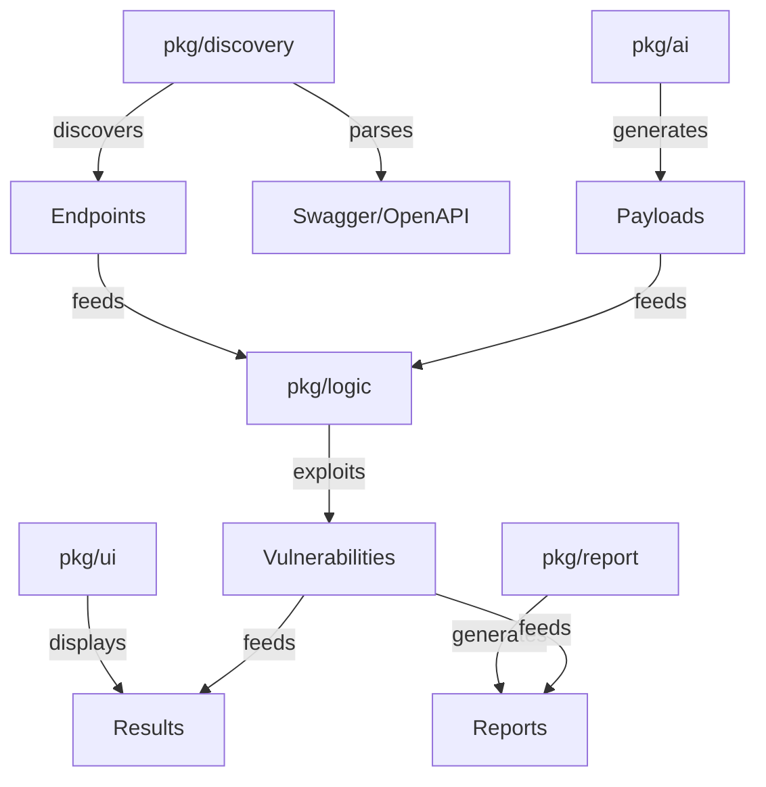

/*
Copyright (c) 2026 José María Micoli
Licensed under the Business Source License 1.1
Change Date: 2033-02-17
Change License: Apache-2.0

You may:
✔ Study
✔ Modify
✔ Use for internal security testing

You may NOT:
✘ Offer as a commercial service
✘ Sell derived competing products
*/

# 19 - API Modules & Module Reference

> **For:** Advanced users & integrators  
> **Read Time:** 30 minutes  
> **Difficulty:** ⭐⭐⭐ Advanced  
> **Last Updated:** February 8, 2026

---

## Overview

> <span style="background-color: #8b5cf6; color: white; padding: 2px 6px; border-radius: 3px;">**API**</span> Complete reference for VaporTrace Go modules and API integration points.

### Module Architecture



---

## Core Modules

### 1. Discovery Module (`pkg/discovery/`)

**Purpose:** API endpoint discovery and parsing

**Key Functions:**

```go
// Discovery engine
type Miner interface {
    Discover(ctx context.Context, target string) ([]Endpoint, error)
    Mine(ctx context.Context, target string, patterns []string) ([]Endpoint, error)
    Parse(content []byte, format string) ([]Endpoint, error)
}

// Endpoint model
type Endpoint struct {
    Method      string
    Path        string
    Parameters  []Parameter
    Description string
    Authentication bool
    SecurityScheme string
}

// Usage
miner := discovery.NewMiner()
endpoints, err := miner.Discover(ctx, "https://api.example.com")
```

**Sub-modules:**
- `scraper.go` - Web scraping and spidering
- `swagger.go` - Swagger/OpenAPI parsing
- `miner.go` - Pattern-based endpoint mining

**Configuration:**
```yaml
discovery:
  spider:
    depth: 5
    max_pages: 10000
  swagger:
    versions: ["2.0", "3.0", "3.1"]
  patterns:
    regex: true
    custom: ["api/v[0-9]+/", "rest/"]
```

---

### 2. Logic Module (`pkg/logic/`)

**Purpose:** Vulnerability testing and exploitation

**Sub-modules:**

#### BOLA (Broken Object Level Authorization)

```go
type BOLATester struct {
    httpClient *http.Client
    endpoints []Endpoint
}

func (b *BOLATester) Test(ctx context.Context) ([]Vulnerability, error) {
    // Test for ID enumeration
    // Test for authorization bypass
    // Generate ID sequences
}
```

**Usage:**
```bash
> test bola --target https://api.example.com
[cyan]TESTING:[-] BOLA vulnerabilities
[green]✓ FOUND:[-] ID 101 accessible without auth
```

#### BFLA (Broken Function Level Authorization)

```go
type BFLATester struct {
    endpoints []Endpoint
    roles []string
}

func (b *BFLATester) TestFunctionAccess(ctx context.Context) []Vulnerability
```

#### BOPLA (Broken Object Property Level Authorization)

```go
type BOPLATester struct {
    endpoints []Endpoint
}

func (b *BOPLATester) TestPropertyAccess(ctx context.Context) []Vulnerability
```

#### SSRF (Server-Side Request Forgery)

```go
type SSRFTester struct {
    payloads []string
}

func (b *SSRFTester) Test(ctx context.Context) []Vulnerability
```

---

### 3. AI Module (`pkg/ai/`)

**Purpose:** LLM-powered payload generation

**Key Functions:**

```go
type LLMClient interface {
    GeneratePayload(ctx context.Context, params PayloadParams) (string, error)
    GenerateExploit(ctx context.Context, vuln Vulnerability) (string, error)
}

// Supported providers
type Provider string
const (
    ProviderGroq       Provider = "groq"
    ProviderOpenAI     Provider = "openai"
    ProviderAnthropic  Provider = "anthropic"
    ProviderLocal      Provider = "local"
)

// Usage
client := ai.NewClient("groq", os.Getenv("GROQ_API_KEY"))
payload, err := client.GeneratePayload(ctx, PayloadParams{
    Type: "sql_injection",
    Encoding: "url",
})
```

**Configuration:**
```yaml
ai:
  provider: groq
  api_key: ${GROQ_API_KEY}
  model: llama2-70b
  temperature: 0.7
  max_tokens: 2000
```

---

### 4. Engine Module (`pkg/engine/`)

**Purpose:** Exploitation orchestration and heuristics

**Key Functions:**

```go
type Engine struct {
    discoverer Miner
    testers    []Tester
    llm        LLMClient
}

func (e *Engine) Scan(ctx context.Context, target string) ([]Vulnerability, error) {
    // Discover endpoints
    // Analyze for vulnerabilities
    // Generate exploits
    // Execute exploitation
}

// Heuristic detection
func DetectAuthBypass(endpoint Endpoint) float64 {
    // Score 0.0-1.0 likelihood of bypass
}
```

---

### 5. UI Module (`pkg/ui/`)

**Purpose:** Terminal user interface

**Key Components:**

```go
// Dashboard
type Dashboard struct {
    scanStatus ScanStatus
    endpoints  []Endpoint
    vulns      []Vulnerability
}

func (d *Dashboard) Render() error

// Interceptor (MITM)
type Interceptor struct {
    requests  chan *http.Request
    responses chan *http.Response
}

// Report tab
type ReportTab struct {
    vulnerabilities []Vulnerability
    filters         map[string]string
}
```

**Usage:**
```bash
> scan https://api.example.com --ui=interactive
# Renders dashboard with real-time updates
```

---

### 6. Report Module (`pkg/report/`)

**Purpose:** Professional report generation

**Key Functions:**

```go
type ReportGenerator struct {
    vulnerabilities []Vulnerability
    metadata        ScanMetadata
}

func (r *ReportGenerator) GenerateMarkdown() (string, error)
func (r *ReportGenerator) GeneratePDF() ([]byte, error)
func (r *ReportGenerator) GenerateHTML() (string, error)
func (r *ReportGenerator) GenerateJSON() ([]byte, error)

// Templates
type Template struct {
    Name     string
    Format   string
    Theme    string
    Include  []string  // sections to include
}
```

**Usage:**
```bash
> report generate --template executive-summary --format pdf
[green]✓ GENERATED:[-] report.pdf (2.3MB)
```

---

## Integration Examples

### Custom Vulnerability Tester

```go
package main

import (
    "context"
    "github.com/vaportrace/pkg/logic"
    "github.com/vaportrace/pkg/discovery"
)

type CustomTester struct {
    client *http.Client
}

func (t *CustomTester) Test(ctx context.Context, endpoint discovery.Endpoint) ([]logic.Vulnerability, error) {
    // Your custom testing logic
    vulns := []logic.Vulnerability{
        {
            Type: "CUSTOM_VULN",
            Severity: "HIGH",
            Description: "Found custom vulnerability",
        },
    }
    return vulns, nil
}

func main() {
    // Register custom tester
    logic.RegisterTester("custom", &CustomTester{})
    
    // Run scan
    // ...
}
```

### Custom Report Format

```go
package main

import (
    "github.com/vaportrace/pkg/report"
)

type CustomFormatter struct{}

func (f *CustomFormatter) Format(vulns []report.Vulnerability) (string, error) {
    // Your custom formatting
    return formatted, nil
}

func main() {
    report.RegisterFormatter("custom", &CustomFormatter{})
}
```

### Webhook Integration

```go
package main

import (
    "github.com/vaportrace/pkg/logic"
)

func OnVulnerabilityFound(vuln logic.Vulnerability) {
    // Send to webhook
    payload := map[string]interface{}{
        "type": vuln.Type,
        "severity": vuln.Severity,
        "endpoint": vuln.Endpoint,
    }
    // http.Post("https://webhook.example.com", ...)
}

func main() {
    logic.OnVulnFound(OnVulnerabilityFound)
}
```

---

## Data Models

### Vulnerability

```go
type Vulnerability struct {
    ID          string
    Type        string          // BOLA, BFLA, SSRF, etc
    Severity    string          // CRITICAL, HIGH, MEDIUM, LOW, INFO
    Confidence  float64         // 0.0-1.0
    Endpoint    string
    Parameter   string
    Payload     string
    Response    string
    Evidence    string
    Description string
    Remediation string
    References  []string
    CreatedAt   time.Time
}
```

### Endpoint

```go
type Endpoint struct {
    Method          string          // GET, POST, PUT, DELETE, etc
    Path            string
    FullURL         string
    Parameters      []Parameter
    Authentication  bool
    SecurityScheme  string          // bearer, api_key, basic, oauth2
    Description     string
    Tags            []string        // api, admin, internal, public
    Deprecated      bool
    RequestBody     *Schema
    ResponseBody    *Schema
}

type Parameter struct {
    Name        string
    In          string          // query, path, header, body
    Required    bool
    Type        string          // string, integer, boolean, array
    Example     string
    Description string
}
```

### ScanMetadata

```go
type ScanMetadata struct {
    ID              string
    Target          string
    StartTime       time.Time
    EndTime         time.Time
    Status          string          // running, completed, failed
    EndpointsFound  int
    VulnsFound      int
    CriticalCount   int
    HighCount       int
    Config          Config
    Errors          []string
}
```

---

## Event Hooks

### Scan Lifecycle Events

```go
// Fired events
OnScanStart(target string)
OnEndpointDiscovered(endpoint Endpoint)
OnEndpointTested(endpoint Endpoint)
OnVulnerabilityFound(vuln Vulnerability)
OnScanComplete(metadata ScanMetadata)
OnScanError(err error)

// Register handlers
logic.OnVulnFound(func(v Vulnerability) {
    fmt.Printf("Found: %s - %s\n", v.Type, v.Severity)
})
```

---

## Plugin System

### Loading Custom Plugins

```bash
# Install plugin
> plugin install https://github.com/user/vapor-plugin.git

# Enable plugin
> plugin enable custom-tester

# List plugins
> plugin list
[cyan]PLUGINS:[-]
  ✓ custom-tester v1.0.0
  ✓ webhook-logger v2.1.0
```

### Creating Plugin

```go
// plugin.go
package main

import "github.com/vaportrace/pkg/logic"

var Plugin = struct {
    Name    string
    Version string
    Init    func() error
}{
    Name: "custom-tester",
    Version: "1.0.0",
    Init: func() error {
        logic.RegisterTester("custom", &CustomTester{})
        return nil
    },
}
```

---

## Performance Tuning

### Concurrent Request Pool

```go
// Configuration
type HTTPPool struct {
    MaxConns        int
    MaxConnsPerHost int
    IdleTimeout     time.Duration
    Timeout         time.Duration
}

// Default: 100 connections, 10 per host, 30s timeout
```

### Caching Layer

```go
// Discovery caching
type DiscoveryCache struct {
    TTL time.Duration
    Max int  // max entries
}

// Default: 1 hour TTL, 10k entries
```

---

## Metrics & Monitoring

### Available Metrics

```bash
> metrics
[cyan]METRICS:[-]
  Endpoints Discovered: 1,234
  Endpoints Tested: 1,234
  Vulnerabilities Found: 42
  Critical: 5
  High: 12
  Medium: 25
  Avg Response Time: 245ms
  Requests/sec: 125
  Memory Usage: 512MB
  CPU Usage: 35%
```

### Exporters

```go
// Prometheus
exporter := NewPrometheusExporter(":9090")

// InfluxDB
exporter := NewInfluxExporter("https://influx.local:8086")

// Custom
exporter := NewCustomExporter(myHandler)
```

---

## Error Handling

### Common Error Types

```go
type ErrorType int

const (
    ErrDiscoveryFailed    ErrorType = iota
    ErrConnectionTimeout
    ErrSSLCertificate
    ErrAuthentication
    ErrRateLimited
    ErrTargetUnreachable
)

// Usage
if errors.Is(err, ErrRateLimited) {
    backoff()
}
```

---

## API Stability

| Version | Status | End of Life |
|---------|--------|------------|
| **3.x** | ✅ Stable | N/A |
| **2.x** | ⚠️ Deprecated | June 2026 |
| **1.x** | ❌ EOL | January 2025 |

---

**See Also:**
- [pkg/logic/](../../pkg/logic/) - Source code
- [pkg/discovery/](../../pkg/discovery/) - Discovery engine
- GitHub: https://github.com/vaportrace/vaportrace/tree/main/pkg

---

**Last Updated:** February 8, 2026  
**Version:** 1.0 - API Stable
